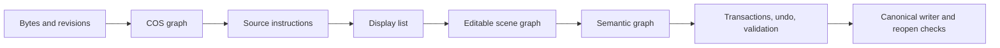

# Wellfriend PDF SDK

Wellfriend PDF SDK is an MIT-licensed, source-linked PDF engine for parsing, rendering, extraction, true editing, reflow, redaction, forms, annotations, OCR layers, standards checks, and multi-language SDK embedding.

Build the CLI:

```bash
cargo build -p wellfriendpdf-cli --release
wellfriendpdf --mode standard capabilities
```

## What Wellfriend enables

- Source-level edits instead of visual cover-ups.
- Operator-preserving edits, geometric block reflow, and semantic document reflow.
- Transactions, provenance, undo, and reopen validation.
- Tables, math, OCR, annotations, AcroForm, XFA preservation boundaries, accessibility, redaction, sanitization, signatures, and standards reporting.
- One canonical Rust core exposed through Rust, CLI, Python, C ABI, WASM, .NET, Java Maven, Java Gradle, and server APIs.

## Choose an execution mode

| Mode | Best for | Hardware | GPU/LLM | Behavior |
|---|---|---|---|---|
| Standard | Production, self-hosting, APIs, desktops, ordinary servers | 2 vCPU / 6 GB minimum; 4 vCPU / 8 GB recommended | Not required | Complete adaptive CPU engine with bounded memory, queues, caching, streaming, tiling, spill, and deterministic output meaning |
| Research | Controlled R&D and enterprise evaluation | Standard baseline plus configured accelerators/providers | Optional | Standard plus optional GPU/model/provider/distributed/experimental infrastructure; falls back to Standard when unavailable |

Public mode values are only `standard` and `research`. OCR provider selection is separate from execution mode.

## Why source-linked editing matters

Wellfriend tracks PDF bytes, COS objects, source instructions, display items, scene nodes, semantic nodes, operation reports, and validation evidence together. A supported edit updates the actual PDF source and records the affected objects, pages, resources, tags, destinations, and undo state. Unsupported or ambiguous edits return typed refusals instead of silently clipping, rasterizing, or painting over old content.

## Major capabilities

| Area | Release-candidate status |
|---|---|
| Parsing, recovery, COS graph, page tree | Verified with documented corpus limits |
| Rendering and SVG/PS/EPS output | Verified with compact release-candidate and regression coverage |
| Text extraction and structured document model | Verified with compact release-candidate and regression coverage |
| Source-linked true editing and reflow | Verified with integrated tests and release-candidate smoke |
| Tables, math, OCR, forms, annotations | Verified with focused subsystem tests and SDK surfaces |
| Accessibility, redaction, sanitization, standards | Verified with existing release gates and documented human-review limits |
| Research accelerators/providers | Infrastructure validated; not benchmark-claimed without configured backends |

## Quick start

```bash
wellfriendpdf --mode standard info input.pdf --json
wellfriendpdf --mode standard render input.pdf --pages 1 --dpi 150 --format png -o pages.zip --json
wellfriendpdf --mode standard extract-text input.pdf
wellfriendpdf --mode standard providers list
```

Configuration files can select Standard or Research and configure resources/OCR providers. Server administrators can force Standard and disable external providers.

## Source-level editing example

```bash
wellfriendpdf --mode standard edit-text-operator input.pdf \
  --source-text "Original" \
  --replacement-text "Updated!" \
  --output edited.pdf \
  --report edit-report.json
```

When the source mapping, shaping, signature policy, or layout constraints are unsafe, the command returns a typed refusal.

## Architecture



## Release-candidate benchmark highlights

The compact release-candidate benchmark used Standard mode on 100 legal PDFs (622 pages, 9071147 bytes). Large public-corpus targets were not met during this session, so broad market-performance claims remain limited. Every number below comes from `benchmarks/results/release-candidate/summary.json`.

| Renderer | 72 DPI median | 150 DPI median | 300 DPI median | Quality failures |
|---|---:|---:|---:|---:|
| Wellfriend Standard | 3.83 ms | 8.32 ms | 28.18 ms | 0 in compact successful-render set |
| Poppler | 8.47 ms | 14.92 ms | 35.57 ms | Not scored as ground truth |
| MuPDF | Not measured | Not measured | Not measured | Not measured |
| PDFium/PDF.js | Not measured | Not measured | Not measured | Unavailable in this run |

| Task | Wellfriend median | Best measured alternative | Correctness | Result |
|---|---:|---:|---|---|
| Text extraction | 2.59 ms | Poppler 6.60 ms | command success on compact subset | Wellfriend measured faster on this subset |
| Parse/info | 2.54 ms | Not applicable | JSON structural output | Wellfriend native surface |
| Source-linked text replacement | 13.85 ms | Not measured as equivalent source-linked API | output qpdf check passed | Unique verified workflow in this measured set |

## Broader market comparison

| Capability | Wellfriend | PDFium | MuPDF | Poppler | qpdf | PDFBox | Commercial SDKs |
|---|---|---|---|---|---|---|---|
| Rendering | Measured compact run | Not measured | Inventory only | Measured compact run | Not applicable | Not measured | Documentation only |
| Structural checking/writing | Integrated engine | Different scope | Different scope | Limited scope | Specialist measured by qpdf check | Not measured | Documentation only |
| Source-linked true editing + undo | Verified Wellfriend capability | Not measured as equivalent | Not measured as equivalent | Not measured as equivalent | Not applicable | Not measured | Documentation only |
| Standards/signatures | Integrated reports and tests | Different scope | Different scope | Different scope | Structural oracle | Not measured | Documentation only |
| OCR layer integration | Integrated provider contracts and tests | Different scope | Different scope | Different scope | Not applicable | Not measured | Documentation only |

## Bindings

Wellfriend exposes the same runtime architecture through Rust, CLI, Python, C ABI, WASM, .NET, Java Maven, Java Gradle, and server APIs. The two execution modes and OCR provider matrix are available through the canonical core rather than binding-specific engines.

## Reproducibility

Tracked compact summaries live under `benchmarks/results/release-candidate/`. Raw logs and corpus PDFs are not committed. The benchmark rows are intentionally scoped: unavailable tools are marked as unavailable or documentation-only, not as Wellfriend wins.

## Current practical boundaries

- This release candidate is ready for owner review with documented limits, not a public release tag.
- The compact corpus does not replace a future large market-comparison campaign.
- Research mode is not a measured production-performance guarantee without configured infrastructure.
- Dynamic XFA, low-confidence OCR/semantic inference, and human accessibility quality remain bounded by explicit policies and review requirements.
- Commercial SDK behavior is documentation-only unless a licensed executable benchmark is run.

## MIT license

Wellfriend PDF SDK is MIT licensed. See `LICENSE`.

## Contributing

Use Standard mode for production bugs and Research mode for controlled accelerator/provider experiments. Keep capability claims tied to same-host evidence and add typed refusals for unsupported PDF cases.
