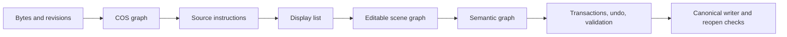

# Wellfriend PDF SDK

Wellfriend PDF SDK is an MIT-licensed, source-linked PDF engine for parsing, rendering, extraction, true editing, reflow, redaction, forms, annotations, OCR layers, standards checks, and multi-language SDK embedding.

Build the CLI:

```bash
cargo build -p wellfriendpdf-cli --release
wellfriendpdf --mode standard capabilities
```

## What Wellfriend enables

- Source-level edits instead of visual cover-ups.
- Operator-preserving edits, geometric block reflow, and semantic document reflow.
- Transactions, provenance, undo, and reopen validation.
- Tables, math, OCR, annotations, AcroForm, XFA preservation boundaries, accessibility, redaction, sanitization, signatures, and standards reporting.
- One canonical Rust core exposed through Rust, CLI, Python, C ABI, WASM, .NET, Java Maven, Java Gradle, and server APIs.

## Choose an execution mode

| Mode | Best for | Hardware | GPU/LLM | Behavior |
|---|---|---|---|---|
| Standard | Production, self-hosting, APIs, desktops, ordinary servers | 2 vCPU / 6 GB minimum; 4 vCPU / 8 GB recommended | Not required | Complete adaptive CPU engine with bounded memory, queues, caching, streaming, tiling, spill, and deterministic output meaning |
| Research | Controlled R&D and enterprise evaluation | Standard baseline plus configured accelerators/providers | Optional | Standard plus optional GPU/model/provider/distributed/experimental infrastructure; falls back to Standard when unavailable |

Public mode values are only `standard` and `research`. OCR provider selection is separate from execution mode.

## Why source-linked editing matters

Wellfriend tracks PDF bytes, COS objects, source instructions, display items, scene nodes, semantic nodes, operation reports, and validation evidence together. A supported edit updates the actual PDF source and records the affected objects, pages, resources, tags, destinations, and undo state. Unsupported or ambiguous edits return typed refusals instead of silently clipping, rasterizing, or painting over old content.

## Major capabilities

| Area | Release-candidate status |
|---|---|
| Parsing, recovery, COS graph, page tree | Verified with documented corpus limits |
| Rendering and SVG/PS/EPS output | Verified with compact release-candidate and regression coverage |
| Text extraction and structured document model | Verified with compact release-candidate and regression coverage |
| Source-linked true editing and reflow | Verified with integrated tests and release-candidate smoke |
| Tables, math, OCR, forms, annotations | Verified with focused subsystem tests and SDK surfaces |
| Accessibility, redaction, sanitization, standards | Verified with existing release gates and documented human-review limits |
| Research accelerators/providers | Infrastructure validated; not benchmark-claimed without configured backends |

## Quick start

```bash
wellfriendpdf --mode standard info input.pdf --json
wellfriendpdf --mode standard render input.pdf --pages 1 --dpi 150 --format png -o pages.zip --json
wellfriendpdf --mode standard extract-text input.pdf
wellfriendpdf --mode standard providers list
```

Configuration files can select Standard or Research and configure resources/OCR providers. Server administrators can force Standard and disable external providers.

## Source-level editing example

```bash
wellfriendpdf --mode standard edit-text-operator input.pdf \
  --source-text "Original" \
  --replacement-text "Updated!" \
  --output edited.pdf \
  --report edit-report.json
```

When the source mapping, shaping, signature policy, or layout constraints are unsafe, the command returns a typed refusal.

## Architecture



## Release-candidate benchmark highlights

Wellfriend now has two committed benchmark tiers:

- Compact release-candidate fixtures for mutation and subsystem checks.
- A real public 5,044-PDF arXiv corpus downloaded on the validation VPS, with 17,059,245,901 bytes and 116,784 qpdf-counted pages across the 5,036 files where qpdf page counting succeeded.

The large corpus was downloaded from public PDF URLs, not generated by Python. Python was used only as orchestration for downloading, sampling, and wrapper tools. Raw PDFs, per-file sample logs, and full command logs remain on the VPS; committed evidence is the compact aggregate in `benchmarks/results/real-5000/real-5000-aggregate.json`.

| Renderer | Real-corpus operation | Median | P95 | Command failures |
|---|---:|---:|---:|---:|
| Wellfriend Standard | first-page PNG render at 72 DPI | 163.80 ms | 514.41 ms | 3 / 5,044 |
| Poppler | first-page PNG render at 72 DPI | 113.80 ms | 164.20 ms | 0 / 5,044 |
| MuPDF | first-page PNG render at 72 DPI | 31.46 ms | 63.59 ms | 2 / 5,044 |
| pypdfium2 / PDFium wrapper | first-page render through bundled PDFium | 7.07 ms | 23.57 ms | 0 / 5,044 |
| PDF.js | first-page open through Node/pdfjs-dist | 4.65 ms | 30.57 ms | 0 / 5,044 |

| Task | Wellfriend median | Measured alternatives | Correctness / scope | Result |
|---|---:|---:|---|---|
| Text extraction | 63.57 ms | Poppler 63.87 ms; MuPDF 163.99 ms | 5,044 real PDFs, command success tracked | Wellfriend and Poppler were comparable on this corpus |
| Parse/info | 113.71 ms | pikepdf open pages 1.75 ms; PDFBox open pages total 28.67 s | Different operation semantics | Wellfriend emits its own JSON parse report |
| Structural validation | Not the same operation | qpdf 63.86 ms; pdfcpu 15.50 ms | qpdf/pdfcpu are structural specialists | Specialist tools are reported separately |
| Source-linked text replacement | 13.85 ms on compact mutation fixtures | Not measured as equivalent source-linked API | output qpdf check passed | Unique verified workflow in this measured set |

## Broader market comparison

| Capability | Wellfriend | PDFium | MuPDF | Poppler | qpdf | PDFBox | Commercial SDKs |
|---|---|---|---|---|---|---|---|
| Rendering | Measured on 5,044 real PDFs | Measured through pypdfium2 wrapper | Measured via MuPDF and PyMuPDF | Measured command-line rendering | Not applicable | Not a renderer in this run | Documentation only |
| Structural checking/writing | Integrated engine | Different scope | Different scope | Limited scope | Specialist measured by qpdf check | Measured open/page count | Documentation only |
| Source-linked true editing + undo | Verified Wellfriend capability | Not measured as equivalent | Not measured as equivalent | Not measured as equivalent | Not applicable | Not measured | Documentation only |
| Standards/signatures | Integrated reports and tests | Different scope | Different scope | Different scope | Structural oracle | Different scope | veraPDF and pyHanko specialist runs measured separately |
| OCR layer integration | Integrated provider contracts and tests | Different scope | Different scope | Different scope | Not applicable | Different scope | OCR accuracy not measured on this born-digital arXiv corpus |

## Bindings

Wellfriend exposes the same runtime architecture through Rust, CLI, Python, C ABI, WASM, .NET, Java Maven, Java Gradle, and server APIs. The two execution modes and OCR provider matrix are available through the canonical core rather than binding-specific engines.

## Reproducibility

Tracked compact summaries live under `benchmarks/results/release-candidate/` and `benchmarks/results/real-5000/`. Raw logs, corpus PDFs, and per-file sample JSONL stay on the VPS result folder recorded in the evidence. The benchmark rows are intentionally scoped: unavailable tools are marked as unavailable or documentation-only, not as Wellfriend wins.

## Current practical boundaries

- This release candidate is ready for owner review with documented limits, not a public release tag.
- The 5,044-PDF corpus is real and large, but domain-skewed toward arXiv academic PDFs; it does not replace a future multi-source market-comparison campaign.
- Research mode is not a measured production-performance guarantee without configured infrastructure.
- Dynamic XFA, low-confidence OCR/semantic inference, and human accessibility quality remain bounded by explicit policies and review requirements.
- Commercial SDK behavior is documentation-only unless a licensed executable benchmark is run.

## MIT license

Wellfriend PDF SDK is MIT licensed. See `LICENSE`.

## Contributing

Use Standard mode for production bugs and Research mode for controlled accelerator/provider experiments. Keep capability claims tied to same-host evidence and add typed refusals for unsupported PDF cases.
