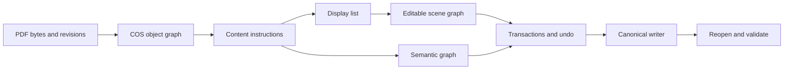

# Wellfriend PDF SDK

Wellfriend PDF SDK is a self-hostable PDF engine for source-linked document editing: it connects bytes, PDF objects, content operators, rendered geometry, semantic structure, transactions, and validation into one embeddable core.

- **License:** MIT, with third-party attributions retained in [NOTICE](NOTICE) and [licensing documentation](docs/licensing.md).
- **Surfaces:** Rust, CLI, Python, C ABI, WASM, .NET, Java/Maven, Java/Gradle, and server crate APIs.
- **Current maturity:** implementation-complete for the documented supported boundary; unsupported or ambiguous operations return typed refusals and structured errors rather than silent visual substitutions.

## Why developers choose Wellfriend

PDFs are not word-processing files. Text, images, forms, annotations, tags, signatures, and page content are distributed across independent objects and revisions. Wellfriend is built for applications that need to edit real PDF source while preserving provenance and producing verifiable output.

Developers use the SDK to build:

- source-level text, path, image, page, and form editing tools;
- geometric and semantic text reflow workflows;
- table, mathematical-content, OCR, annotation, and AcroForm editing flows;
- true redaction and sanitization pipelines with residual checks;
- PDF inspection, extraction, rendering, conversion, signing, and standards-validation services;
- multi-language products that use one canonical Rust implementation.

## Key capabilities

| Area | Support summary |
|---|---|
| Parsing and recovery | COS graph, xref/object stream handling, page tree operations, encryption reporting, deterministic serialization. |
| Rendering and extraction | In-process raster/SVG rendering, text extraction, structured extraction, tables, fields, images, HTML and Office exports. |
| True editing | Operator-preserving source edits, scene transactions, text reflow, table/math/OCR/form/annotation subsystems, undo reports. |
| Document subsystems | Editable tables, math trees, scan-preserving OCR layers, annotation appearances, AcroForm values/widgets, XFA preservation boundaries. |
| Security | Full-rewrite redaction, residual verification, sanitization, active-content inventory, signature-impact reporting. |
| Standards and accessibility | Internal PDF/A, PDF/UA, PDF/X, WTPDF-oriented checks and accessibility repair helpers; external certification is not claimed. |
| Bindings | Rust core plus CLI, Python, C ABI, WASM, .NET, Maven, Gradle, and server surfaces over the same engine path. |

## Quick start

```bash
cargo build -p wellfriendpdf-cli --release
./target/release/wellfriendpdf --help
./target/release/wellfriendpdf info input.pdf
./target/release/wellfriendpdf extract-text input.pdf --structured --format json
```

For library use, add the engine crate from this workspace or consume one of the packaged bindings once you have built the corresponding artifact for your platform.

## Real source-editing example

This example patches a resolved text-showing operator and verifies the reopened output. It does not draw cover-up text over the old content.

```rust
use wellfriendpdf_engine::{edit_text_operator, ContentEngine, OperatorTextEditRequest};

let input: Vec<u8> = std::fs::read("input.pdf")?;
let request = OperatorTextEditRequest {
    page: 1,
    source_text: "ABC".to_string(),
    replacement_text: "DEF".to_string(),
    signature_policy_override: false,
};

let (edited, report) = edit_text_operator(&input, &request)?;
let reopened = ContentEngine::open_bytes(edited)?;
let text = reopened.get_page_text(1)?;

assert_eq!(report.unaffected_content_proof["overlay_used"], false);
assert!(text.contains("DEF"));
```

A complete runnable version lives at [crates/engine/examples/readme_source_edit.rs](crates/engine/examples/readme_source_edit.rs).

## Architecture



The important design choice is that every supported edit has a source and a validation path. Bindings do not implement separate document models; they serialize requests into the same engine.

## Performance benchmarks

The numbers below are from the committed benchmark summary in [benchmarks/results/latest/summary.json](benchmarks/results/latest/summary.json). They were measured on the validation VPS with release builds, one worker, warmups, median/p95 timing, and correctness recorded separately.

| Wellfriend task | Median ms | P95 ms | Failures |
|---|---:|---:|---:|
| open parse | 0.005 | 0.005 | 0 |
| text extraction | 0.028 | 0.031 | 0 |
| render page png 72dpi | 0.137 | 0.143 | 0 |
| source text replacement save reopen | 0.745 | 0.752 | 0 |
| paragraph reflow save reopen | 0.514 | 0.529 | 0 |
| table cell edit save reopen | 37.161 | 43.102 | 0 |
| ocr searchable layer save reopen | 0.205 | 0.215 | 0 |
| redaction residual verification | 0.447 | 0.464 | 0 |

See [docs/benchmarks/current-evidence.md](docs/benchmarks/current-evidence.md) and [benchmarks/methodology.md](benchmarks/methodology.md) for the corpus, method, environment, and limits.

## Competitor landscape

Measured rows use the same host. Documentation-only rows are described in [docs/benchmarks/competitor-comparison.md](docs/benchmarks/competitor-comparison.md); they are not treated as benchmark wins or losses.

| Tool | Operation | Median ms | P95 ms | Status |
|---|---|---:|---:|---|
| qpdf | structural_check | 1.689 | 1.795 | measured_comparable |
| qpdf | structural_rewrite | 1.791 | 1.822 | measured_comparable |
| Poppler pdfinfo | page_count | 3.858 | 3.966 | measured_comparable |
| Poppler pdftotext | text_extraction | 3.975 | 4.172 | measured_comparable |
| pikepdf (qpdf wrapper) | open_save | 0.347 | 0.380 | measured_comparable |
| pypdfium2 (PDFium wrapper) | page_count | 0.038 | 0.051 | measured_comparable |
| PyMuPDF (MuPDF wrapper) | text_and_render | 0.513 | 0.590 | measured_comparable |
| pdfplumber | text_extraction | 0.668 | 0.724 | measured_comparable |

How to read this:

- qpdf and pikepdf are structural specialists; they are excellent for object-level rewrite/repair and are not semantic editors.
- Poppler, PDFium, MuPDF, and PDF.js have mature viewing, rendering, and extraction ecosystems.
- veraPDF and pyHanko specialize in standards and signatures.
- pdfplumber, Camelot, Docling, Tesseract, and OCRmyPDF specialize in extraction or OCR workflows.
- Commercial SDKs such as Adobe PDF Library/Datalogics, Apryse, Nutrient, Foxit PDF SDK, and iText may have proprietary behavior not represented by these local measurements.
- Wellfriend's distinctive scope is provenance-linked true editing, transactions, undo, semantic reflow, and integrated document subsystems over one embeddable core.

## Language bindings

| Surface | Current package/API identity |
|---|---|
| Rust | Workspace crates named `wellfriendpdf-*`; core engine exports through `wellfriendpdf-engine`. |
| CLI | `wellfriendpdf` binary from `wellfriendpdf-cli`. |
| Python | `wellfriendpdf` module from `crates/wellfriendpdf-py`. |
| C ABI | `wellfriendpdf.h` and `wellfriendpdf_*` symbols. |
| WASM | `@wellfriendpdf/wellfriendpdf-wasm`. |
| .NET | `WellfriendPdf` namespace/package. |
| Java | `io.wellfriendpdf` Maven/Gradle package identity. |
| Server | `wellfriendpdf-server` crate for self-hosted service integration. |

## Feature overview

| Feature family | Current maturity |
|---|---|
| Operator source edits | Verified on supported source-operator cases. |
| Geometric and semantic reflow | Verified for bounded regions and supported flow graphs. |
| Tables/math/OCR | Supported with review/approval requirements for low-confidence or inferred data. |
| Annotations/forms | Supported for documented annotation types, appearances, AcroForm values/widgets, and flattening boundaries. |
| XFA | Inventory, preservation, data extraction/import paths, static planning; dynamic conversion is not claimed. |
| Redaction/sanitization | Source rewrite and residual checks for supported targets. |
| Standards/signatures | Internal validation and signature-impact reporting; external certification is separate. |

## Documentation

- [Capabilities](docs/capabilities.md)
- [Architecture](docs/architecture.md)
- [Current benchmark evidence](docs/benchmarks/current-evidence.md)
- [Benchmark methodology](benchmarks/methodology.md)
- [Competitor comparison](docs/benchmarks/competitor-comparison.md)
- [Licensing](docs/licensing.md)
- [Current boundaries](docs/limitations.md)
- [Engineering validation summary](docs/reports/validation-summary.md)

## Current boundaries

Wellfriend is not a universal claim of Adobe parity, all-viewer rendering parity, or complete support for every historical PDF edge case. Unsupported writing modes, ambiguous source mappings, unsafe glyph reconstruction, low-confidence semantic/OCR inference, signature-policy conflicts, and dynamic XFA conversion return scoped errors or review requirements. Accessibility repair can improve structures, but human review remains necessary for document meaning and alternate-text quality.

## License

Wellfriend-owned code is licensed under the [MIT License](LICENSE). Third-party dependency and font attributions remain in [NOTICE](NOTICE) and [docs/licensing.md](docs/licensing.md).

## Contributing

Run the focused repository gates before sending changes:

```bash
python scripts/check_repository_naming.py
cargo fmt --all -- --check
git diff --check
cargo check --workspace --all-targets --jobs 1
```

Benchmark changes should update `benchmarks/results/latest/` and the evidence docs from the same run.
