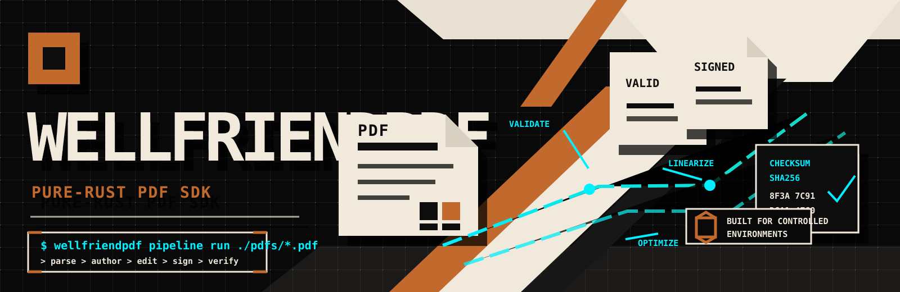
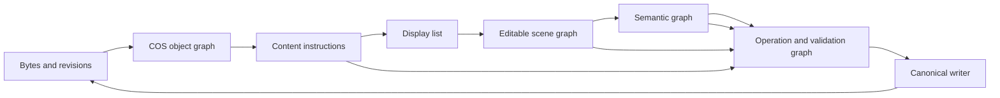

# Wellfriend PDF SDK



Wellfriend PDF SDK is a source-linked PDF editing engine for Rust and multi-language applications, built around provenance, transactions, typed refusals, and canonical save/reopen validation.

Current status: `implementation_complete`<br>
Release posture: `release_ready_with_limits`<br>
License: MIT OR Apache-2.0<br>
Supported surfaces: Rust, CLI, Python, C ABI, WASM, .NET, Java, and a self-hostable server crate.

Wellfriend is not presented as universal Adobe parity or a complete implementation of every PDF edge case. Unsupported, ambiguous, low-confidence, policy-blocked, or unsafe operations are expected to return typed refusals instead of silently painting over content, clipping overflow, corrupting source structures, or claiming unverified success.

## What it is

Wellfriend is a source-linked true-editing SDK for PDFs. It works below the usual “draw a replacement overlay” layer: supported edits can resolve original bytes, COS objects, content instructions, display/scene nodes, semantic nodes, resources, and validation state before mutating the document through one canonical writer path.

The same core is used by the Rust crate, CLI, Python package, C ABI, WASM build, .NET package, Java package, and server crate. Binding-specific code is an ownership and serialization layer, not a second PDF engine.

## Why it is different

Most PDF tools specialize in one layer: rendering, structural transformation, signing, validation, extraction, OCR, forms, or UI editing. Wellfriend’s distinctive scope is the integration of those layers for provenance-linked editing:

- byte and revision provenance;
- COS graph and canonical object ownership;
- content instruction parsing and source rewriting;
- display list and editable scene graph;
- semantic graph and reading-flow reconstruction;
- transaction, inverse-operation, and undo reporting;
- validation, residual checking, and release evidence.

Edit modes are explicit:

| Mode | Scope | Behavior outside scope |
| --- | --- | --- |
| `OperatorPreserving` | Source-level operator edits where text/path/image/Form ownership is known. | Typed refusal; no silent escalation. |
| `GeometricBlock` | Reflow inside a bounded source-linked region with known neighbors and constraints. | Overflow, ambiguity, or constraint refusal. |
| `SemanticDocument` | Reconstruct and reflow paragraphs, columns, pages, tables, OCR layers, forms, annotations, and downstream flow where confidence/policy allow it. | Review-required or refusal when inference is low-confidence. |

## Current status

The current pushed baseline is:

```text
d346915de5125fccf3163847cb3ebec197c49046
Close combined prompt 36 true editing validation enterprise release
```

Prompt 36 evidence records `implementation_status=complete`, `release_posture=release_ready_with_limits`, and `prompt36_complete=true`. The phrase “with limits” is intentional: it means the implementation closed the true-editing roadmap under repository validation, while some external tools, host-specific package paths, commercial comparisons, viewer matrices, dynamic XFA behavior, OCR confidence, and human accessibility review remain bounded or explicitly outside automatic claims.

Public claims are classified in [docs/readme_claim_register.md](docs/readme_claim_register.md). Benchmark and comparator details are in [docs/benchmarks/current-evidence.md](docs/benchmarks/current-evidence.md) and [docs/benchmarks/competitor-comparison.md](docs/benchmarks/competitor-comparison.md).

## By the numbers

These are current evidence-backed numbers only; they are not an overall “best PDF engine” ranking.

| Evidence | Current result | Class | Source |
| --- | ---: | --- | --- |
| Prompt 36 closure criteria | 42 / 42 pass | validated in repository | [current evidence](docs/benchmarks/current-evidence.md) |
| Max observed RSS during Prompt 36 validation | 6,618,920 KiB under a 33,554,432 KiB budget | validated in repository | [current evidence](docs/benchmarks/current-evidence.md) |
| Fuzz target inventory | 43 targets built and smoke-run | validated in repository | [current evidence](docs/benchmarks/current-evidence.md) |
| Fuzz smoke depth | 64 runs per target | validated in repository | [current evidence](docs/benchmarks/current-evidence.md) |
| README same-fixture smoke | 11 / 11 operations passed | measured directly | [methodology](docs/benchmarks/methodology.md) |
| qpdf / Poppler Prompt 36 oracles | available and run | validated in repository | [competitor comparison](docs/benchmarks/competitor-comparison.md) |
| PDFium / MuPDF README smoke | measured through pypdfium2 and PyMuPDF wrappers | measured directly with wrapper disclosure | [competitor comparison](docs/benchmarks/competitor-comparison.md) |
| Gradle on VPS | exact host limit; Maven Java runtime/package passed | validated in repository | [known limits](docs/readme_known_limits.md) |

## Capability matrix

Maturity labels:

- `Verified`: repository validation and focused evidence passed.
- `Verified with limits`: supported and validated for stated cases, with explicit boundaries.
- `Supported`: runtime path exists; exhaustive validation may be narrower.
- `Review required`: low-confidence or destructive cases require caller approval.
- `Typed refusal outside scope`: unsupported/ambiguous cases preserve input and return an exact status.
- `External validation unavailable`: external oracle was unavailable on the validation host.
- `Not supported`: no claimed runtime support.

| Area | Status | Notes |
| --- | --- | --- |
| Parser, xref/object streams, recovery | Verified with limits | Canonical parser and source provenance are used by editing and validation paths. |
| Rendering and extraction | Verified with limits | Internal rendering/extraction plus qpdf/Poppler smoke evidence; viewer parity is not claimed universally. |
| Authoring and structural operations | Verified with limits | Merge/split/page operations, canonical writer, object-stream/xref-stream paths, repair and linearization support. |
| True editing | Verified with limits | Operator-preserving edits, source-level text/path/image/Form occurrence edits, transactions, undo, and clone-on-write reporting. |
| Fonts, Unicode, shaping, reflow | Verified with limits | Unicode extraction, shaping/subset reconstruction, geometric and semantic reflow with typed overflow/refusal. |
| Tables, math, OCR | Verified with limits | Editable table graph, math model/editing, OCR three-layer model, confidence/review workflow. |
| Annotations/forms/XFA | Verified with limits | Annotation and AcroForm editing/appearance regeneration; XFA preservation and static-boundary reporting; no universal dynamic-XFA conversion claim. |
| Tagged PDF and accessibility | Verified with limits | Tagged repair and accessibility analysis are implemented; human accessibility review remains a boundary. |
| Redaction and sanitization | Verified with limits | Source/pixel/OCR/history residual checks and fail-closed behavior for unsafe resolution. |
| Encryption and signatures | Verified with limits | Distinguishes cryptographic integrity, certificate trust, and document coverage/modification state. |
| Standards | Verified with limits | Internal PDF/A, PDF/UA, PDF/X, WTPDF checks; external veraPDF was unavailable in Prompt 36 and README attempts. |
| Bindings | Verified with limits | Rust/CLI/Python/C/WASM/.NET/Java Maven passed; Gradle host limit recorded. |

More detail: [docs/current-capabilities.md](docs/current-capabilities.md).

## Architecture



Every supported edit carries source evidence forward: byte ranges, object IDs, stream/instruction ownership, display items, scene nodes, semantic nodes, transaction revision, affected resources, validation results, and inverse operations.

## Quick start

Prerequisites:

- Rust stable compatible with the workspace toolchain;
- optional Python, .NET, Java, and WASM tooling for bindings;
- optional OCR backend through the `ocr` / `full` feature where Tesseract integration is required.

Build the CLI:

```bash
cargo build -p wellfriendpdf-cli
```

Run the current CLI help:

```bash
cargo run -p wellfriendpdf-cli -- --help
```

Run a repository-owned smoke fixture:

```bash
cargo run -p wellfriendpdf-cli -- extract-text crates/engine/tests/fixtures/minimal.pdf --format text
cargo run -p wellfriendpdf-cli -- parse crates/engine/tests/fixtures/minimal.pdf --format json
```

Feature flags are defined by the engine and CLI crates. The engine default is `parse,render,structural`; `full` enables the larger feature set; `ocr` enables OCR plumbing where the backend is built. The CLI default has no optional OCR backend; rebuild with `--features ocr` or `--features full` for OCR-backed commands.

## Rust example

This snippet creates a compact PDF, inspects it, applies a supported source-preserving edit path, saves, reopens, and handles typed errors through stable error codes.

```rust
use wellfriendpdf_engine::{
    AuthorPageSize as PageSize, ContentEngine, EditMode, EditTextStyle, OverlayLayer,
    PdfBuilder, PdfEditor, StandardFont, TextStyle,
};

fn main() -> wellfriendpdf_engine::Result<()> {
    let mut doc = PdfBuilder::new();
    doc.add_page(PageSize::LETTER)
        .draw_text(
            "Source text",
            72.0,
            720.0,
            &TextStyle::standard(StandardFont::Helvetica, 14.0),
        )?;

    let bytes = doc.to_bytes()?;
    let engine = ContentEngine::open_bytes(bytes.clone())?;
    assert_eq!(engine.page_count()?, 1);

    let mut editor = PdfEditor::open_bytes(bytes)?;
    editor.draw_text(
        1,
        "Reviewed",
        72.0,
        690.0,
        EditTextStyle::new(12.0),
        OverlayLayer::Overlay,
    )?;

    let out = editor.save_to_bytes(EditMode::FullRewrite)?;
    let reopened = ContentEngine::open_bytes(out)?;
    let text = reopened.get_page_text(1)?;
    assert!(text.contains("Source text"));
    assert!(text.contains("Reviewed"));

    if let Err(err) = ContentEngine::open_bytes(Vec::new()) {
        eprintln!("typed error code: {}", err.code());
    }

    Ok(())
}
```

The README compile check for this snippet is recorded in the README validation artifacts.

## CLI examples

These command names are taken from the current `wellfriendpdf --help` surface. Use `cargo run -p wellfriendpdf-cli -- <command> --help` for command-specific options.

```bash
# Text and document model
wellfriendpdf extract-text input.pdf --structured --format json
wellfriendpdf parse input.pdf --format markdown
wellfriendpdf document-model input.pdf --format json

# Tables, fields, forms, annotations, and XFA reports
wellfriendpdf extract-tables input.pdf --format json
wellfriendpdf extract-fields input.pdf --format json
wellfriendpdf forms-report input.pdf -o forms.json
wellfriendpdf annotations-report input.pdf -o annotations.json
wellfriendpdf xfa-report input.pdf -o xfa.json

# True editing and reflow surfaces
wellfriendpdf provenance-report input.pdf --page 1 --source-text "term" --replacement-text "term"
wellfriendpdf edit-eligibility input.pdf --page 1 --source-text "old" --replacement-text "new"
wellfriendpdf layout-analyze input.pdf --page 1 --json-output layout.json
wellfriendpdf reflow-preview input.pdf --page 1 --source-text "old" --replacement-text "new" --json-output preview.json
wellfriendpdf reflow-region input.pdf --page 1 --source-text "old" --replacement-text "new" --output edited.pdf --report reflow.json

# Security, standards, and signatures
wellfriendpdf security-report input.pdf --json
wellfriendpdf sanitize input.pdf --output sanitized.pdf --policy balanced
wellfriendpdf validate input.pdf --json
wellfriendpdf signature-report input.pdf --json
```

Only use mutation commands with explicit input/output and policy options. Unsupported or unsafe mutations are expected to report a precise status rather than performing a hidden cover-up.

## Bindings

| Surface | Current name |
| --- | --- |
| Rust engine crate | `wellfriendpdf-engine` |
| CLI crate / binary | `wellfriendpdf-cli` / `wellfriendpdf` |
| Python package/import | `wellfriendpdf` |
| C ABI crate/header/prefix | `wellfriendpdf-capi`, `wellfriendpdf.h`, `wellfriendpdf_*` |
| WASM package | `@wellfriendpdf/wellfriendpdf-wasm` |
| .NET package/namespace | `WellfriendPdf` |
| Java group/package/artifact | `io.wellfriendpdf`, `wellfriendpdf-sdk` |
| Server crate | `wellfriendpdf-server` |

Binding parity is routed through the same core. The Prompt 36 binding matrix passed Rust, CLI, Python, C ABI, WASM, .NET, and Java Maven runtime/package checks. Gradle remained an exact VPS host limit because the installed Gradle 4.4.1 cannot evaluate the modern settings file, while Maven validated the Java runtime path.

## Benchmarks

Benchmarking is grouped by task, not collapsed into a fake overall score. Current tracked benchmark material is in:

- [docs/benchmarks/current-evidence.md](docs/benchmarks/current-evidence.md)
- [docs/benchmarks/current-evidence.json](docs/benchmarks/current-evidence.json)
- [docs/benchmarks/methodology.md](docs/benchmarks/methodology.md)

Direct README comparisons were run on VPS `35.185.176.47` using one compact repository-owned fixture normalized for qpdf-compatible structural checks. The smoke covered Wellfriend CLI extraction/parse, qpdf check/linearization, Poppler info/text/render, pypdfium2/PDFium render, PyMuPDF/MuPDF text/render, pikepdf/qpdf rewrite, and pdfplumber extraction. This is useful for README accuracy; it is not a corpus benchmark and not a broad performance claim.

## Competitor landscape

Full detail: [docs/benchmarks/competitor-comparison.md](docs/benchmarks/competitor-comparison.md).

| Group | Tools | README posture |
| --- | --- | --- |
| Mature render/view engines | PDFium, MuPDF, PyMuPDF, Poppler, PDF.js | Mature rendering/viewer ecosystems. README smoke measured pypdfium2/PDFium, PyMuPDF/MuPDF, and Poppler on a compact fixture; PDF.js is documentation-only here. |
| Structural specialists | qpdf, pikepdf, pdfcpu, PDFBox | qpdf and pikepdf measured; PDFBox measured for open/page count; pdfcpu unavailable because Go was unavailable on the VPS. qpdf is structural, not a semantic editor. |
| Standards and signatures | veraPDF, pyHanko | veraPDF is a validator and was unavailable on the VPS; pyHanko CLI availability was measured, but signature capability remains documentation-oriented unless a signing corpus is run. |
| Extraction/OCR | Docling, pdfplumber, Camelot, Tesseract, OCRmyPDF | pdfplumber measured for extraction; Tesseract version was available; Camelot installed and was smoke-run separately; Docling/OCRmyPDF were not treated as benchmarked. |
| Commercial SDKs | iText, Apryse, Nutrient, Foxit PDF SDK, Adobe PDF Library / Datalogics | Official-documentation comparison only; no benchmark license was used. Commercial proprietary behavior may be broader than public docs show. |
| Rust ecosystem | lopdf, pdf-writer, printpdf, pdf-extract and related crates | Documentation/crate-scope comparison only; not scored as losses. |

Wellfriend’s comparative claim is narrow: it integrates provenance-linked true editing, transactions, undo, semantic reflow, table/math/OCR/forms/annotation systems, redaction/sanitization, and multi-binding deployment in one source-linked core. It is not claimed to replace every specialist in every deployment.

## Security posture

Wellfriend’s security posture is based on fail-closed editing and validation boundaries:

- resource limits and cancellation paths for parsing/layout/reflow/OCR-style operations;
- fuzz target inventory and sanitizer results in Prompt 36 artifacts;
- explicit native/unsafe boundary audits;
- repository hygiene scan artifacts without exposing matched source text;
- source-level redaction and sanitization residual checks;
- typed refusal for unresolved provenance, unsafe edits, signature policy conflicts, ambiguous structure, low-confidence OCR/semantic inference, or unsupported active content.

Redaction claims are intentionally narrow. Supported paths remove or rewrite source operators or pixels, update OCR/searchable/reconstructed layers, repair semantic/tagged structures where supported, full-rewrite where history removal is requested, remove selected metadata/attachments/actions under policy, run residual checks, and fail closed when source resolution is unsafe.

## Standards and signatures

Wellfriend distinguishes:

- cryptographic integrity;
- certificate trust;
- document coverage and post-signature modification state.

Internal standards engines cover implemented PDF/A, PDF/UA, PDF/X, and WTPDF checks with documented rule support. External validation is useful, but unavailable tools are not silently counted as passes. Prompt 36 recorded qpdf and Poppler evidence; veraPDF was unavailable and remains an external-validation limit here.

Signature support reports mathematical/CMS integrity separately from trust anchoring and policy. Do not treat a self-signed or unanchored certificate as trusted merely because a signature’s bytes verify.

## Known limits

The release posture is `release_ready_with_limits`. Important limits include:

- typed refusals for unsupported, ambiguous, or low-confidence edits;
- low-confidence semantic/OCR reconstruction requires review rather than silent destructive apply;
- dynamic XFA conversion is not claimed as universal or lossless;
- all-viewer appearance parity is not claimed;
- accessibility automation does not replace human accessibility review;
- some external tools were unavailable on the VPS and are not counted as failures of those tools;
- Gradle validation is constrained by the VPS Gradle 4.4.1 host package, while Maven validated the Java path;
- commercial SDK comparisons are documentation-only unless a legitimate benchmark license is available.

See [docs/readme_known_limits.md](docs/readme_known_limits.md).

## Reproducibility

Current evidence is split between tracked summaries and ignored raw artifacts:

- tracked summaries: [docs/benchmarks/current-evidence.md](docs/benchmarks/current-evidence.md), [docs/benchmarks/competitor-comparison.md](docs/benchmarks/competitor-comparison.md);
- local generated README registers: `target/readme-rewrite/`;
- Prompt 36 evidence: `/home/demisuga01/wellpdf/results/prompt36-20260729T063834Z`;
- README comparator evidence: `/home/demisuga01/wellpdf/results/readme-competitor-20260729T175541Z`;
- memory budget for VPS runs: 32 GiB aggregate.

Raw logs, corpora, rendered pages, downloaded wheels, comparator binaries, and target caches are intentionally not tracked.

## Documentation index

- [Current capabilities](docs/current-capabilities.md)
- [README claim register](docs/readme_claim_register.md)
- [README known limits](docs/readme_known_limits.md)
- [Prompt 36 release readiness](docs/prompt36_release_readiness_report.md)
- [Prompt 36 known limits](docs/prompt36_known_limits.md)
- [True editing product claims](docs/true_editing_product_claims.md)
- [Benchmark evidence](docs/benchmarks/current-evidence.md)
- [Benchmark methodology](docs/benchmarks/methodology.md)
- [Competitor comparison](docs/benchmarks/competitor-comparison.md)

## License and contributing

Wellfriend PDF SDK is licensed under MIT OR Apache-2.0. See [LICENSE-MIT](LICENSE-MIT), [LICENSE-APACHE](LICENSE-APACHE), and [NOTICE](NOTICE).

Before contributing, keep claims evidence-backed, preserve dirty worktrees unless explicitly authorized, avoid committing raw corpora or generated caches, and route new functionality through the canonical parser, writer, scene/semantic systems, transaction model, and bindings rather than adding parallel subsystem implementations.
