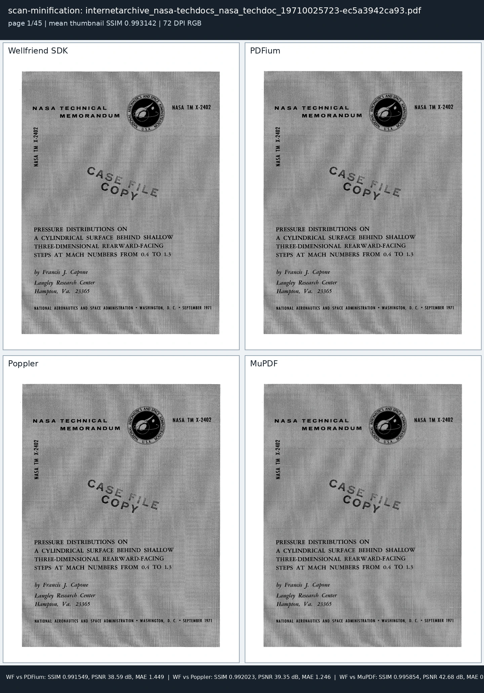

# Wellfriend PDF SDK

Wellfriend PDF SDK is an MIT-licensed PDF engine for parsing, rendering,
extracting, editing, transforming, validating, and securing PDF documents. Rust
is the canonical implementation. The CLI, HTTP server, C ABI, Python, WASM,
.NET, and Java packages use the same engine.

## Capabilities

| Area | Included workflows |
|---|---|
| Parse and inspect | Page trees, content streams, text, tables, forms, annotations, attachments, metadata, fonts, images, signatures, and document structure |
| Render | PNG, JPEG, WebP, raw pixels, SVG, PostScript, and EPS with transparency, soft masks, optional content, color management, clipping, patterns, shadings, Type 3 fonts, and reusable render contracts |
| Edit | Source-linked text and object editing, paragraph and linked-story reflow, image and vector changes, scanned-word reconstruction, forms, annotations, watermarking, and redaction |
| Transform | Merge, split, extract, rotate, crop, resize, organize, flatten, linearize, optimize, sanitize, encrypt, decrypt, and sign |
| Convert | Text, Markdown, JSON, HTML, DOCX, PPTX, XLSX, images, and PDF/A workflows |
| Integrate | Rust library, command-line tool, HTTP API, C ABI, Python, WebAssembly, .NET, and Java |

## Latest verification

The current renderer qualification uses a 150-document public and
interoperability corpus containing 9,214 pages and 2.036 GiB of source data.
It executes the optimized Linux binary on
the VPS with one document worker, the display-list pipeline, document-local
resource caches, 72 DPI RGB output, and raw-pixel evidence.

| Verification | Result |
|---|---:|
| Focused renderer regressions | 15/15 pass |
| Tiling-pattern unit regressions | 16/16 pass |
| Directly inspected four-renderer comparison sheets | 4/4 readable and clean |
| Full 150-document all-page render | 150/150 documents; 9,214/9,214 pages; 0 errors |
| Full corpus wall time | 54m 04.289s |

The release binary used for this run has SHA-256
`d02e9a9346120328537da72ea697f2c37969eab1ff52c86d76edb45353691959`.
The [renderer qualification report](docs/reports/renderer-closure-vps-20261005/README.md)
contains the complete contract, per-file evidence, timings, image comparisons,
and reproducibility hashes.

The comparison below renders the same scanned page at 72 DPI with Wellfriend,
PDFium, Poppler, and MuPDF. The published sheet is generated directly from the
qualified binaries and visually inspected before publication.



## Requirements

| Component | Requirement |
|---|---|
| Rust workspace | Rust 1.95 or newer and Cargo |
| Python binding | Python 3.9+ and `maturin` |
| WASM binding | `wasm-pack` and a wasm32 Rust target |
| .NET binding | .NET 8 SDK |
| Java binding | JDK 25 with preview FFM enabled |
| Native bindings | A locally built `wellfriendpdf_capi` shared library |
| Optional OCR | Tesseract development and runtime libraries |
| Optional native CMM | Build with `native-cmm-lcms2` |

```powershell
git clone https://github.com/demisuga01-lab/wellfriendpdf.git
cd wellfriendpdf
cargo build --workspace --jobs 2
```

The engine default features are `parse`, `render`, and `structural`. The
`full` feature adds extraction, creation, editing, signing, standards, and
OCR-facing APIs.

## Packages

| Component | Path | Primary use |
|---|---|---|
| Rust engine | `crates/engine` | Core document APIs |
| CLI | `crates/cli` | Shell workflows and JSON reports |
| HTTP server | `crates/server` | Authenticated multipart APIs and progressive sessions |
| SIMD kernels | `crates/render-simd` | CPU and wasm32 raster kernels |
| C ABI | `crates/wellfriendpdf-capi` | Native integration boundary |
| Python | `crates/wellfriendpdf-py` | PyO3/maturin package |
| WASM | `crates/wellfriendpdf-wasm` | Browser, WebWorker, and Node APIs |
| .NET | `bindings/dotnet/WellfriendPdf` | .NET 8 wrapper |
| Java | `bindings/java` | JDK 25 FFM wrapper |
| OCR | `crates/wellfriendpdf-ocr-tesseract` | Optional Tesseract provider |
| Visual comparison | `tools/renderer-visual-diff` | Raster normalization and image metrics |

## Rust Engine

`ContentEngine` is the main document entry point. Page numbers are 1-based.

```rust
use wellfriendpdf_engine::ContentEngine;

fn main() -> wellfriendpdf_engine::Result<()> {
    let engine = ContentEngine::open_path("input.pdf")?;
    println!("pages: {}", engine.page_count()?);
    println!("{}", engine.get_page_text(1)?);

    let png = engine.render_page_png_fast(1, 150)?;
    std::fs::write("page-1.png", png)?;
    Ok(())
}
```

Add the local crate from another workspace:

```toml
[dependencies]
wellfriendpdf-engine = { path = "../wellfriendpdf/crates/engine" }
```

### Render contracts and caller-owned surfaces

A `RenderContract` carries every output-affecting field into validation and
cache identity: page/revision, DPI, box, transform, clip, surface layout,
background, backend, compositing, optional content, smoothing, print/color
policy, exactness, determinism, and resource budgets.

```rust
use wellfriendpdf_engine::{CancelToken, ContentEngine};
use wellfriendpdf_engine::render::RenderMode;

fn render() -> wellfriendpdf_engine::Result<()> {
    let engine = ContentEngine::open_path("input.pdf")?;
    let contract = engine.default_render_contract(1, 150, RenderMode::Compat)?;

    let png = engine.render_page_png_with_contract(
        &contract,
        &CancelToken::none(),
    )?;
    std::fs::write("contract-page.png", png)?;

    let mut surface = vec![0_u8; contract.stride * contract.height as usize];
    engine.render_page_into_buffer(
        &contract,
        &CancelToken::none(),
        &mut surface,
    )?;
    Ok(())
}
```

Use `RenderDocumentCache` overloads when repeated renders belong to the same
document/revision and contract policy. Apply the render-invalidation plan
returned by supported editing transactions before publishing cached output.

### Progressive rendering

Progressive jobs render a deterministic tile queue and reject stale
publications with revision, contract, visibility, scheduler, and tile identity.

```rust
use wellfriendpdf_engine::{CancelToken, ContentEngine};
use wellfriendpdf_engine::render::RenderMode;

fn progressive() -> wellfriendpdf_engine::Result<()> {
    let engine = ContentEngine::open_path("input.pdf")?;
    let contract = engine.default_render_contract(1, 150, RenderMode::Compat)?;
    let mut job = engine.progressive_render_job_with_contract(contract, 256, 256)?;

    while !job.is_complete() {
        let report = job.render_next(4, &CancelToken::none())?;
        for publication in report.completed_tile_publications {
            println!("publish {}", publication.publication_identity);
        }
    }

    let pixels = job.finish_checked()?;
    println!("{}x{}", pixels.width, pixels.height);
    Ok(())
}
```

Use `revise_viewport_hint`, `revise_dirty_region`, or
`revise_render_contract` when viewer state changes. Full contract revision
rebuilds the output region and tile grid, invalidates prior publications, and
returns an obsolete-publication report. Use `request_cancel`, `pause`, `resume`,
and `close` for lifecycle control.

### Editing and invalidation

The shared SDK facade exposes JSON transaction methods when a language binding
needs a versioned transport:

```rust
let (edited_pdf, result_json) = wellfriendpdf_engine::sdk::
    editing_transactions_transaction_apply_with_render_invalidation_json(
        &pdf_bytes,
        request_json,
        Some(render_invalidation_options_json),
        None,
    )?;
# let _ = (edited_pdf, result_json);
```

The result includes edited bytes/report data plus source IDs, affected pages,
dirty regions/tiles, and cache-pruning instructions when exact dependency
coverage is available. Unknown dependencies deliberately broaden invalidation.

## Command-Line Interface

Build once, then invoke `target/release/wellfriendpdf` (add `.exe` on Windows):

```powershell
cargo build -p wellfriendpdf-cli --release --jobs 2
target\release\wellfriendpdf.exe --mode standard capabilities
```

Common workflows:

```powershell
# Document facts and text
target\release\wellfriendpdf.exe --mode standard info input.pdf --json
target\release\wellfriendpdf.exe --mode standard extract-text input.pdf

# Raster output and a reusable schema-v1 contract
target\release\wellfriendpdf.exe --mode standard render input.pdf --pages 1 --dpi 150 --format png --output pages.zip
target\release\wellfriendpdf.exe --mode standard render input.pdf --pages 1 --dpi 150 --write-contract-json --output pages.zip
target\release\wellfriendpdf.exe --mode standard render input.pdf --contract-json contract.json --format raw --output page.raw

# Renderer architecture/capability reports
target\release\wellfriendpdf.exe --mode standard feature-report
target\release\wellfriendpdf.exe --mode standard document-views-report input.pdf
target\release\wellfriendpdf.exe --mode standard backend-plan-arena-report input.pdf --page 1 --dpi 72
target\release\wellfriendpdf.exe --mode standard image-decode-capability-report input.pdf

# Source-linked editing and a machine-readable report
target\release\wellfriendpdf.exe --mode standard edit-text-operator input.pdf --source-text "Original" --replacement-text "Updated" --output edited.pdf --report edit-report.json

# Security and standards reporting
target\release\wellfriendpdf.exe --mode standard security-report input.pdf --json
target\release\wellfriendpdf.exe --mode standard validate input.pdf --profile all --json
```

Use `wellfriendpdf <command> --help` to inspect that operation's inputs,
outputs, and machine-readable result schema.

## HTTP Server

The server listens on port `8080` by default. Production instances use API
keys; loopback development can enable the explicit unauthenticated mode.

```powershell
$env:WELLFRIENDPDF_ALLOW_UNAUTHENTICATED = "true"
$env:WELLFRIENDPDF_PORT = "8080"
cargo run -p wellfriendpdf-server --jobs 2
```

For a protected instance, unset `WELLFRIENDPDF_ALLOW_UNAUTHENTICATED`, set
`WELLFRIENDPDF_API_KEYS` to a comma-separated key list, and send either
`X-API-Key: <key>` or `Authorization: Bearer <key>`.

Build and consume a render contract with PowerShell 7:

```powershell
$form = @{ file = Get-Item .\input.pdf; page = "1"; dpi = "150" }
$built = Invoke-RestMethod -Method Post -Uri http://127.0.0.1:8080/api/v1/render-contract -Form $form

$renderForm = @{
  file = Get-Item .\input.pdf
  contract_json = $built.contract_json
}
Invoke-WebRequest -Method Post -Uri http://127.0.0.1:8080/api/v1/render-contract/png -Form $renderForm -OutFile page.png
```

Primary endpoint groups:

| Group | Endpoints |
|---|---|
| Health/runtime | `GET /health`, `/readiness`, `/api/v1/version`, `/api/v1/capabilities`, `/api/v1/runtime-config`, `/api/v1/providers` |
| Parse/extract | `POST /api/v1/info`, `/parse`, `/extract-text`, `/extract-images`, `/extract-fields`, `/analyze` |
| Render contract | `POST /api/v1/render-contract`, `/png`, `/raw`, report variants, `/backend-plan-arena-report` |
| Progressive page render | `POST /api/v1/progressive/start`, `/:id/step`, `/pause`, `/resume`, `/viewport`, `/dirty-region`, `/render-context`, `/cancel`, `/finish`, `/close` |
| Viewer scheduling | `POST /api/v1/progressive/:id/queue/execute`, `/adjacent-prefetch/execute`, `/callbacks`, `/evaluate-publication` |
| Decode/prepress | `POST /api/v1/image-decode/capability-report`, `/progressive-image-decode/lifecycle-report`, `/prepress/plate-report` |
| Editing/cache | `POST /api/v1/editing-transactions/apply-with-render-invalidation`, `/progressive/:id/apply-render-invalidation` |

Multipart document routes accept a `file` part. Contract render routes accept a
canonical `contract_json` part. Progressive `/render-context` accepts either a
full `render_contract_json`/`contract_json` revision or the legacy fingerprint
fields, but not both in one request.

## C ABI

Build the native library and include the checked-in header:

```powershell
cargo build -p wellfriendpdf-capi --release --jobs 2
```

Artifacts are `wellfriendpdf_capi.dll`, `libwellfriendpdf_capi.so`, or
`libwellfriendpdf_capi.dylib`; the public header is
[`crates/wellfriendpdf-capi/include/wellfriendpdf.h`](crates/wellfriendpdf-capi/include/wellfriendpdf.h).

The normal call flow is:

1. Open caller-owned bytes with `wellfriendpdf_document_open_from_bytes`.
2. Query or transform through `wellfriendpdf_document_*` functions.
3. Build/round-trip schema-v1 contracts with the `wellfriendpdf_render_contract_*` functions.
4. Start progressive jobs with `wellfriendpdf_document_progressive_render_new_with_contract_json` and revise them with `wellfriendpdf_progressive_render_revise_render_contract_json`.
5. Free returned `char *` values with `wellfriendpdf_string_free`, returned `WellfriendBuffer` values with `wellfriendpdf_buffer_free`, and every opaque handle with its matching free function.

Every fallible function takes or returns an error channel. Never free Rust-owned
memory with the C allocator.

## Python

Build a local ABI3 wheel with maturin:

```powershell
python -m pip install maturin
python -m maturin build --release --manifest-path crates\wellfriendpdf-py\Cargo.toml --out target\wheels
$wheel = Get-ChildItem target\wheels\wellfriendpdf-0.1.0-*.whl |
  Sort-Object LastWriteTime -Descending |
  Select-Object -First 1
python -m pip install $wheel.FullName
```

```python
import wellfriendpdf

doc = wellfriendpdf.open("input.pdf")
print(doc.page_count)
print(doc.page(1).text)
print(doc.security_report())

png = doc.page(1).render(dpi=150)
with open("page.png", "wb") as output:
    output.write(png)

contract_json = doc.default_render_contract_json(1, dpi=150)
cache = doc.render_cache()
png, cache_report = doc.render_contract_png_with_render_cache_report(
    contract_json,
    cache,
)
```

The binding also exposes cancellation, caller-owned `bytearray` rendering,
font-substitution/telemetry reports, progressive page jobs, progressive image
decode lifecycle reports, transaction invalidation, semantic/chunk/search
reports, sanitization, redaction, and Office export helpers. See
[`crates/wellfriendpdf-py/README.md`](crates/wellfriendpdf-py/README.md) for the
full binding surface.

## WebAssembly

```powershell
wasm-pack build crates\wellfriendpdf-wasm --target web --out-dir pkg
wasm-pack build crates\wellfriendpdf-wasm --target nodejs --out-dir pkg-node
```

```typescript
import init, { WellfriendPdf } from "./pkg/wellfriendpdf_wasm.js";

await init();
const pdf = new WellfriendPdf(new Uint8Array(await file.arrayBuffer()));
console.log(JSON.parse(pdf.securityReportJson()));
const png = pdf.renderPagePng(1, 150);
pdf.close();
```

WASM accepts bytes and returns bytes or JSON. `ProgressiveRenderJob` supports
cancellation checks, queue execution, callback reports, adjacent-page prefetch,
and `reviseRenderContractJson`. The TypeScript declaration source is
[`crates/wellfriendpdf-wasm/wellfriendpdf.d.ts`](crates/wellfriendpdf-wasm/wellfriendpdf.d.ts).

## .NET

Build the C ABI first and point the managed resolver at it:

```powershell
cargo build -p wellfriendpdf-capi --release --jobs 2
$env:WELLFRIENDPDF_NATIVE_LIBRARY = (Resolve-Path target\release\wellfriendpdf_capi.dll)
dotnet build bindings\dotnet\WellfriendPdf\WellfriendPdf.csproj
```

```csharp
using WellfriendPdf;

using var doc = WellfriendDocument.Open("input.pdf", password: null);
var contract = doc.DefaultRenderContract(pageNumber: 1, dpi: 150)
    .WithResourceBudget(maxPixels: 20_000_000);

File.WriteAllBytes("page.png", doc.RenderPagePng(contract));
var surface = new byte[checked((int)contract.SurfaceByteLength)];
doc.RenderPageIntoBuffer(contract, surface);

using var session = doc.ProgressiveRenderSession(contract, tileWidth: 256, tileHeight: 256);
session.ReviseRenderContract(contract.WithBackground(248, 250, 252));
```

Use `using`/`Dispose()` for document, cache, cancellation, and progressive
handles. `RenderContract` is an immutable-style managed value object. See
[`bindings/dotnet/WellfriendPdf/README.md`](bindings/dotnet/WellfriendPdf/README.md).

## Java

The binding uses the JDK 25 Foreign Function and Memory API.

```powershell
cargo build -p wellfriendpdf-capi --release --jobs 2
$env:WELLFRIENDPDF_NATIVE_LIBRARY = (Resolve-Path target\release\wellfriendpdf_capi.dll)
cd bindings\java
mvn test package
```

```java
try (var doc = WellfriendPdf.Document.open(Path.of("input.pdf"), null)) {
    var contract = doc.defaultRenderContract(1, 150)
        .withResourceBudget(20_000_000L, null, null, null);
    Files.write(Path.of("page.png"), doc.renderPagePng(contract));

    ByteBuffer surface = ByteBuffer.allocateDirect(
        Math.toIntExact(contract.surfaceByteLength()));
    doc.renderPageIntoBuffer(contract, surface);

    try (var session = doc.progressiveRenderSession(contract, 256, 256)) {
        session.reviseRenderContract(contract.withBackground(248, 250, 252));
    }
}
```

Run Java with `--enable-preview --enable-native-access=ALL-UNNAMED`. Maven and
Gradle project files are both checked in; see
[`bindings/java/README.md`](bindings/java/README.md) for native loading and smoke
commands.

## OCR, SIMD, and Color Management

OCR is optional. Enable the native adapter explicitly:

```powershell
cargo build -p wellfriendpdf-cli --features ocr --release --jobs 2
cargo build -p wellfriendpdf-server --features ocr --release --jobs 2
```

`wellfriendpdf-render-simd` is an internal implementation crate. Call renderer
APIs normally; runtime dispatch selects guarded scalar, portable-wide, native
CPU, or wasm32 `simd128` rows and preserves scalar-equivalence fallbacks.

Portable color management is the default. Enable native LittleCMS support only
where that dependency is available:

```powershell
cargo build -p wellfriendpdf-cli --features native-cmm-lcms2 --release --jobs 2
```

## Verification Tools

`tools/renderer-visual-diff` normalizes pixel format, alpha, background, crop,
and dimensions and calculates image metrics. `tools/pdfium-harness` provides a
direct PDFium comparator. Reports pin the source commit, dataset manifest,
binary hashes, comparator versions, command lines, outcomes, and raw evidence.

## Error and Safety Model

- Page numbers are 1-based across public APIs.
- Passwords are operation-scoped inputs and are not retained by managed wrappers.
- Errors include typed machine-readable context and complete paint accounting.
- Exact render mode validates source operations and resources before pixel publication.
- Caller-owned surfaces validate dimensions, stride, pixel format, alpha mode, and byte length.
- Progressive consumers must evaluate publication identity after viewport, revision, visibility, or contract changes.
- Editing callers must apply returned invalidation plans before reusing renderer caches.
- Server deployments should configure API keys, request limits, timeouts, and CORS explicitly.

## Development Checks

Run lightweight checks serially when resources are constrained:

```powershell
cargo fmt --all --check
cargo check --workspace --all-targets --jobs 1
cargo clippy --workspace --all-targets --jobs 1 -- -D warnings
cargo check --workspace --all-features --all-targets --jobs 1
cargo clippy --workspace --all-features --all-targets --jobs 1 -- -D warnings
cargo test --workspace --all-targets --all-features --no-fail-fast --jobs 1 -- --test-threads=1
```

Focused tests live beside the corresponding Rust modules and under each
binding/server test directory. Large PDF corpora, visual adjudication,
performance measurements, and competitor comparisons are separate validation
campaigns rather than ordinary source checks.

## Documentation

- [`docs/api_overview.md`](docs/api_overview.md): Rust API orientation.
- [`docs/stability.md`](docs/stability.md): pre-1.0 API stability policy.
- [`docs/renderer/final-universal-renderer-implementation-report.md`](docs/renderer/final-universal-renderer-implementation-report.md): renderer internals.
- [`docs/renderer/complete-algorithm-and-method-inventory.md`](docs/renderer/complete-algorithm-and-method-inventory.md): algorithm and entry-point inventory.

## License

Wellfriend PDF SDK is available under the MIT License. See [`LICENSE`](LICENSE).
