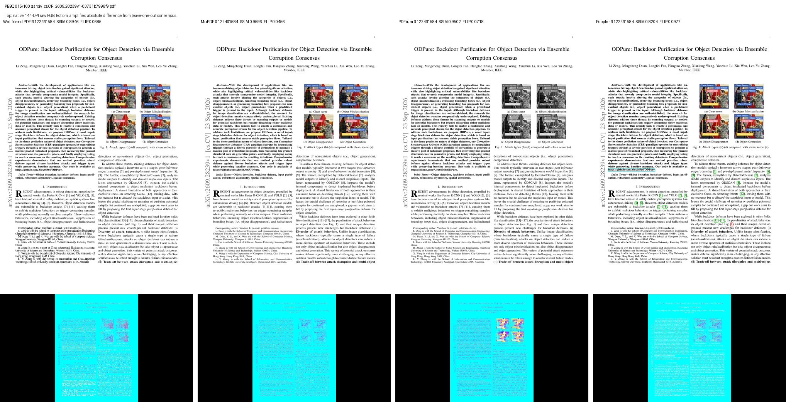

# Wellfriend PDF SDK

Wellfriend PDF SDK is an MIT-licensed PDF engine for parsing, raster and vector
rendering, extraction, source-linked editing, document reflow, forms,
annotations, redaction, standards analysis, and multi-language embedding. The
canonical implementation is Rust; the CLI, HTTP server, C ABI, Python, WASM,
.NET, and Java packages use that same engine.

> The repository is currently source-first and pre-1.0 (`0.1.0`). Packages are
> built from this checkout; no package publication is implied by this README.

## Benchmark Results

### Current 150-document comprehensive qualification - 2026-10-03/04

This is the current broad VPS qualification on 150 real-world PDFs (2.036 GiB,
9,214 pages), including 50 additional 10-268 MiB technical reports. It tests
matched parsing and all-page rendering, supported structural/conversion
operations, PDF/A, and seven Wellfriend editing routes. The
[complete report and raw JSONL evidence](docs/reports/comprehensive-150-vps-20261003/README.md)
identify the exact commit, binaries, versions, corpus hashes, contracts,
postconditions, timings, quality metrics, refusals, and failures.

| Benchmark | Wellfriend SDK | PDFium | Poppler | MuPDF | qpdf |
|---|---:|---:|---:|---:|---:|
| Resolved page counts | 150/150 | 150/150 | 150/150 | 150/150 | 150/150 |
| Resident parse P50 | 0.93 ms | 0.57 ms | 2.71 ms | 2.38 ms | 3.46 ms |
| Fresh-process parse P50 | 14.31 ms | 15.29 ms | 45.54 ms | 25.96 ms | 37.58 ms |
| Merge postconditions | 143/150 | N/A | 150/150 | 143/150 | 150/150 |
| Split postconditions | 141/150 | N/A | 147/150 | 141/150 | 150/150 |
| Repair postconditions | 56/150 | N/A | N/A | 150/150 | 150/150 |
| Text extraction postconditions | 139/150 | N/A | 150/150 | 149/150 | N/A |
| Complete all-page renders | 135/150 | 150/150 | 150/150 | 150/150 | N/A |
| Pages emitted / expected | 3,649/9,214 | 9,214/9,214 | 9,214/9,214 | 9,214/9,214 | N/A |
| Complete-document render P50 | 6,625.17 ms | 1,094.97 ms | 1,677.90 ms | 859.82 ms | N/A |
| Complete-document per-page P50 | 284.43 ms | 44.64 ms | 78.66 ms | 45.41 ms | N/A |
| Wellfriend thumbnail SSIM P50 vs engine | - | 0.979152 | 0.918150 | 0.982698 | N/A |
| Verified edit route-document cases | 97/1,050 | N/A | N/A | N/A | N/A |
| Independently compliant PDF/A-2B conversions | 7/150 | N/A | N/A | N/A | N/A |

This is not a 100/100 result. Wellfriend completes 135/150 all-page render
jobs and emits 3,649/9,214 corpus pages before 15 terminal failures; PDFium,
Poppler, and MuPDF complete all 150 and all 9,214 pages. Rendering similarity
is measured only on 3,596 complete paired pages and is not treated as ground
truth. Editing records 97 verified passes across 1,050 route-document cases:
30 operator-preserving, 3 scene-source, 10 direct-SDK paragraph reflow, and 54
vector duplication. The public CLI paragraph-reflow route fails all 135
applicable files because its command-local `--mode paragraph-reflow` collides
with the global `standard|research` execution mode. The VPS is shared, so speed
figures are observed evidence rather than laboratory-isolated competitive
claims. qpdf is N/A for raster rendering because it is not a renderer.

The worst successful three-reference paired page is visibly incorrect in the
Wellfriend panel (mean thumbnail SSIM 0.339822); terminal render failures are
not included in this image.


### Current PEBQ matched-contract qualification - 2026-10-02

This is the current matched-contract cross-engine comparison. Each native
adapter receives the same in-memory page-count request or the same page-one
144-DPI raw-RGB render request. The adapter process remains resident, while
every request reopens the document. File reading, process startup, and raster
encoding stay outside the process-resident timer. The fixed 100-PDF corpus,
3,697 raw observations, native adapter sources, hashes, strict dimension
failures, and 100 visual comparison sheets are in the
[complete PEBQ report](docs/reports/pebq-vps-20261002/README.md).

#### Document open + resolved page count - process-resident, document-cold

Each percentile uses one median per PDF, so every document has equal weight.

| Benchmark | Wellfriend PDF | qpdf | MuPDF | PDFium | Poppler |
|---|---:|---:|---:|---:|---:|
| Qualified page counts | 100/100 | 100/100 | 100/100 | 100/100 | 100/100 |
| P50 | 1.186 ms | 5.240 ms | 1.704 ms | 0.666 ms | 3.203 ms |
| P90 | 2.017 ms | 15.951 ms | 5.442 ms | 1.193 ms | 4.932 ms |
| P95 | 2.473 ms | 24.242 ms | 9.440 ms | 1.539 ms | 5.527 ms |
| P99 | 8.746 ms | 27.682 ms | 21.883 ms | 4.770 ms | 11.764 ms |
| Maximum | 35.692 ms | 29.779 ms | 34.941 ms | 37.239 ms | 13.123 ms |

PDFium has the lowest document-cold median. Wellfriend PDF is second. On the
100 paired documents, Poppler/Wellfriend has a 2.680x median ratio with a
bootstrap 95% interval of 2.377x-2.943x. The 20x claim is **rejected**.

The raw 300-observation distribution has an 11.771 ms P99 and a 48.555 ms
maximum for Wellfriend PDF. This is consistent: nearest-rank P99 is observation
297, leaving three observations above it. All three are `i1040gi.pdf` at
24.415, 35.692, and 48.555 ms. The tail is a reproducible hard-document path,
not evidence that the maximum belongs inside P99. Poppler handles that document
faster at a 13.123 ms median.

This profile does not mean that every object, content stream, font, image, or
signature is eagerly decoded. It measures the same externally visible
operation for every engine: open identical in-memory bytes and resolve the page
count. Library-specific lazy work remains outside that narrow contract.

#### Rendering - process-resident, document-cold native raw RGB

Each percentile uses one median per PDF. Every request performs a new render;
the profile does not reuse a final page raster.

| Benchmark | Wellfriend PDF | qpdf | MuPDF | PDFium | Poppler |
|---|---:|---:|---:|---:|---:|
| Successful renders | 100/100 | N/A (no rasterizer) | 100/100 | 100/100 | 100/100 |
| P50 | 114.979 ms | - | 48.451 ms | 41.370 ms | 47.973 ms |
| P90 | 206.626 ms | - | 88.260 ms | 66.382 ms | 83.988 ms |
| P95 | 271.934 ms | - | 107.667 ms | 100.459 ms | 126.741 ms |
| P99 | 533.881 ms | - | 136.061 ms | 203.666 ms | 215.028 ms |
| Maximum | 554.989 ms | - | 242.380 ms | 304.614 ms | 247.404 ms |

Wellfriend PDF renders every page. PDFium has the lowest P50 through P95,
while MuPDF has the lowest P99 and maximum. Wellfriend PDF is not the fastest
renderer in this profile. Its median is 2.78x PDFium's median. A single-digit
document-cold target requires at least a 12.8x median speedup and is not a
current result.

#### Rendering - retained resources, fresh raster

This separate profile opens each PDF once, warms resources once, and then
executes three new full-page rasters with final-pixel caching disabled.

| Benchmark | Wellfriend PDF | MuPDF | PDFium | Poppler |
|---|---:|---:|---:|---:|
| Successful documents | 100/100 | 100/100 | 100/100 | 100/100 |
| P50 | 85.802 ms | 14.315 ms | 23.754 ms | 46.582 ms |
| P90 | 128.807 ms | 28.546 ms | 36.831 ms | 75.748 ms |
| P95 | 159.532 ms | 34.325 ms | 72.795 ms | 107.362 ms |
| P99 | 218.646 ms | 45.863 ms | 200.248 ms | 205.693 ms |
| Maximum | 239.446 ms | 82.233 ms | 212.789 ms | 236.042 ms |

Repeated dimensions and hashes are stable for 400/400 engine-document pairs.
Wellfriend output identity matches its qualified reference output on 100/100
shared PDFs. Wellfriend is still not the fastest renderer; this profile does
not support a single-digit full-page claim. Raw rows, binary/source hashes, and
the precise contract are in the
[retained-resource report](docs/reports/pebq-vps-20261003-retained/README.md).

#### Rendering quality - leave-one-engine-out consensus

| Benchmark | Wellfriend PDF | qpdf | MuPDF | PDFium | Poppler |
|---|---:|---:|---:|---:|---:|
| Dimension-qualified pages | 97/100 | N/A | 97/100 | 97/100 | 97/100 |
| SSIM P50 (higher is closer) | 0.946905 | - | 0.964567 | 0.962659 | 0.854784 |
| Mean FLIP P50 (lower is closer) | 0.038033 | - | 0.030910 | 0.043193 | 0.063104 |
| Mean Delta-E 2000 P50 (lower is closer) | 1.530997 | - | 1.257197 | 1.370901 | 3.435389 |

Consensus is a symmetric diagnostic, not a ground-truth oracle. Three Poppler
outputs differ from the other engines by one native pixel in width or height;
those pages are strict failures and never resize into the quality scores. The
inspected offset-transparency page contains all four image panels
and scores 0.894591 SSIM and 0.068472 mean FLIP. Editing is not included in this
matched document-open/renderer campaign because the reference tools do not expose
equivalent source-edit contracts.



## Repository Status

The renderer source includes schema-v1 render contracts, caller-owned surfaces,
bounded document caches, packed retained plans, transaction-driven
invalidation, persistent clip state, transparency and soft-mask execution,
display/print/proof policies, deterministic tile scheduling, progressive image
and page lifecycles, native CPU/WASM SIMD kernels, font-substitution reports,
Type 3 retained programs, JPX capability reporting, SVG/PostScript regional
output, and visual-normalization tooling.

Unsupported PDF or backend cases fail through typed errors or explicitly
reported policies. Codec-native region, tile, component, reduction, and
progressive capabilities are reported from the selected decoder rather than
being simulated.

The latest runtime qualification and exact current verdict are in the
[2026-10-02 PEBQ report](docs/reports/pebq-vps-20261002/README.md). The renderer
architecture remains documented in
[`docs/renderer/final-universal-renderer-implementation-report.md`](docs/renderer/final-universal-renderer-implementation-report.md),
and universal-editing implementation details are recorded in
[`docs/universal_editing_v2_implementation_report.md`](docs/universal_editing_v2_implementation_report.md).

## Requirements

| Component | Requirement |
|---|---|
| Rust workspace | Rust 1.95 or newer; Cargo |
| Python binding | Python 3.9+ and `maturin` |
| WASM binding | `wasm-pack` and a wasm32 Rust target |
| .NET binding | .NET 8 SDK |
| Java binding | JDK 25 with preview FFM enabled |
| Native bindings | A locally built `wellfriendpdf_capi` shared library |
| Optional OCR | Tesseract development/runtime libraries for the native OCR adapter |
| Optional native CMM | Build with the `native-cmm-lcms2` feature |

Clone and build the default workspace:

```powershell
git clone https://github.com/demisuga01-lab/wellfriendpdf.git
cd wellfriendpdf
cargo build --workspace --jobs 2
```

For a smaller production build, select only the component you need. The engine
default features are `parse`, `render`, and `structural`; its `full` feature
adds extraction, creation, editing, signing, standards, and OCR-facing APIs.

## Component Map

| Component | Package/path | Use it for |
|---|---|---|
| Rust engine | `crates/engine` / `wellfriendpdf-engine` | Native library integration and all core APIs |
| CLI | `crates/cli` / `wellfriendpdf-cli` | Shell workflows and JSON reports |
| HTTP server | `crates/server` / `wellfriendpdf-server` | Authenticated multipart HTTP API and progressive sessions |
| SIMD kernels | `crates/render-simd` | Internal CPU and wasm32 `simd128` raster kernels |
| C ABI | `crates/wellfriendpdf-capi` | Stable native boundary used by C, .NET, and Java |
| Python | `crates/wellfriendpdf-py` | PyO3/maturin package named `wellfriendpdf` |
| WASM | `crates/wellfriendpdf-wasm` | Browser, WebWorker, and Node byte-oriented APIs |
| .NET | `bindings/dotnet/WellfriendPdf` | `net8.0` managed wrapper over the C ABI |
| Java | `bindings/java` | JDK 25 FFM wrapper over the C ABI |
| Native OCR | `crates/wellfriendpdf-ocr-tesseract` | Optional Tesseract-backed OCR provider |
| Visual normalization | `tools/renderer-visual-diff` | Future same-policy image normalization and comparison |
| PDFium harness | `tools/pdfium-harness` | Future direct comparator harness; not required by the engine |

## Rust Engine

`ContentEngine` is the main document entry point. Page numbers are 1-based.

```rust
use wellfriendpdf_engine::ContentEngine;

fn main() -> wellfriendpdf_engine::Result<()> {
    let engine = ContentEngine::open_path("input.pdf")?;
    println!("pages: {}", engine.page_count()?);
    println!("{}", engine.get_page_text(1)?);

    let png = engine.render_page_png_fast(1, 150)?;
    std::fs::write("page-1.png", png)?;
    Ok(())
}
```

Add the local crate from another workspace while packages remain unpublished:

```toml
[dependencies]
wellfriendpdf-engine = { path = "../wellfriendpdf/crates/engine" }
```

### Render contracts and caller-owned surfaces

A `RenderContract` carries every output-affecting field into validation and
cache identity: page/revision, DPI, box, transform, clip, surface layout,
background, backend, compositing, optional content, smoothing, print/color
policy, exactness, determinism, and resource budgets.

```rust
use wellfriendpdf_engine::{CancelToken, ContentEngine};
use wellfriendpdf_engine::render::RenderMode;

fn render() -> wellfriendpdf_engine::Result<()> {
    let engine = ContentEngine::open_path("input.pdf")?;
    let contract = engine.default_render_contract(1, 150, RenderMode::Compat)?;

    let png = engine.render_page_png_with_contract(
        &contract,
        &CancelToken::none(),
    )?;
    std::fs::write("contract-page.png", png)?;

    let mut surface = vec![0_u8; contract.stride * contract.height as usize];
    engine.render_page_into_buffer(
        &contract,
        &CancelToken::none(),
        &mut surface,
    )?;
    Ok(())
}
```

Use `RenderDocumentCache` overloads when repeated renders belong to the same
document/revision and contract policy. Apply the render-invalidation plan
returned by supported editing transactions before publishing cached output.

### Progressive rendering

Progressive jobs render a deterministic tile queue and reject stale
publications with revision, contract, visibility, scheduler, and tile identity.

```rust
use wellfriendpdf_engine::{CancelToken, ContentEngine};
use wellfriendpdf_engine::render::RenderMode;

fn progressive() -> wellfriendpdf_engine::Result<()> {
    let engine = ContentEngine::open_path("input.pdf")?;
    let contract = engine.default_render_contract(1, 150, RenderMode::Compat)?;
    let mut job = engine.progressive_render_job_with_contract(contract, 256, 256)?;

    while !job.is_complete() {
        let report = job.render_next(4, &CancelToken::none())?;
        for publication in report.completed_tile_publications {
            println!("publish {}", publication.publication_identity);
        }
    }

    let pixels = job.finish_checked()?;
    println!("{}x{}", pixels.width, pixels.height);
    Ok(())
}
```

Use `revise_viewport_hint`, `revise_dirty_region`, or
`revise_render_contract` when viewer state changes. Full contract revision
rebuilds the output region and tile grid, invalidates prior publications, and
returns an obsolete-publication report. Use `request_cancel`, `pause`, `resume`,
and `close` for lifecycle control.

### Editing and invalidation

The shared SDK facade exposes JSON transaction methods when a language binding
needs a versioned transport:

```rust
let (edited_pdf, result_json) = wellfriendpdf_engine::sdk::
    editing_transactions_transaction_apply_with_render_invalidation_json(
        &pdf_bytes,
        request_json,
        Some(render_invalidation_options_json),
        None,
    )?;
# let _ = (edited_pdf, result_json);
```

The result includes edited bytes/report data plus source IDs, affected pages,
dirty regions/tiles, and cache-pruning instructions when exact dependency
coverage is available. Unknown dependencies deliberately broaden invalidation.

## Command-Line Interface

Build once, then invoke `target/release/wellfriendpdf` (add `.exe` on Windows):

```powershell
cargo build -p wellfriendpdf-cli --release --jobs 2
target\release\wellfriendpdf.exe --mode standard capabilities
```

Common workflows:

```powershell
# Document facts and text
target\release\wellfriendpdf.exe --mode standard info input.pdf --json
target\release\wellfriendpdf.exe --mode standard extract-text input.pdf

# Raster output and a reusable schema-v1 contract
target\release\wellfriendpdf.exe --mode standard render input.pdf --pages 1 --dpi 150 --format png --output pages.zip
target\release\wellfriendpdf.exe --mode standard render input.pdf --pages 1 --dpi 150 --write-contract-json --output pages.zip
target\release\wellfriendpdf.exe --mode standard render input.pdf --contract-json contract.json --format raw --output page.raw

# Renderer architecture/capability reports
target\release\wellfriendpdf.exe --mode standard feature-report
target\release\wellfriendpdf.exe --mode standard document-views-report input.pdf
target\release\wellfriendpdf.exe --mode standard backend-plan-arena-report input.pdf --page 1 --dpi 72
target\release\wellfriendpdf.exe --mode standard image-decode-capability-report input.pdf

# Source-linked editing and a machine-readable report
target\release\wellfriendpdf.exe --mode standard edit-text-operator input.pdf --source-text "Original" --replacement-text "Updated" --output edited.pdf --report edit-report.json

# Security and standards reporting
target\release\wellfriendpdf.exe --mode standard security-report input.pdf --json
target\release\wellfriendpdf.exe --mode standard validate input.pdf --profile all --json
```

Run `wellfriendpdf <command> --help` before automating a command: mutation
commands have explicit output/refusal policies and do not all share the same
arguments.

## HTTP Server

The server listens on port `8080` by default. It refuses unauthenticated startup
unless API keys are configured or local-development access is explicitly
enabled.

```powershell
$env:WELLFRIENDPDF_ALLOW_UNAUTHENTICATED = "true"
$env:WELLFRIENDPDF_PORT = "8080"
cargo run -p wellfriendpdf-server --jobs 2
```

For a protected instance, unset `WELLFRIENDPDF_ALLOW_UNAUTHENTICATED`, set
`WELLFRIENDPDF_API_KEYS` to a comma-separated key list, and send either
`X-API-Key: <key>` or `Authorization: Bearer <key>`. Do not expose development
mode publicly.

Build and consume a render contract with PowerShell 7:

```powershell
$form = @{ file = Get-Item .\input.pdf; page = "1"; dpi = "150" }
$built = Invoke-RestMethod -Method Post -Uri http://127.0.0.1:8080/api/v1/render-contract -Form $form

$renderForm = @{
  file = Get-Item .\input.pdf
  contract_json = $built.contract_json
}
Invoke-WebRequest -Method Post -Uri http://127.0.0.1:8080/api/v1/render-contract/png -Form $renderForm -OutFile page.png
```

Primary endpoint groups:

| Group | Endpoints |
|---|---|
| Health/runtime | `GET /health`, `/readiness`, `/api/v1/version`, `/api/v1/capabilities`, `/api/v1/runtime-config`, `/api/v1/providers` |
| Parse/extract | `POST /api/v1/info`, `/parse`, `/extract-text`, `/extract-images`, `/extract-fields`, `/analyze` |
| Render contract | `POST /api/v1/render-contract`, `/png`, `/raw`, report variants, `/backend-plan-arena-report` |
| Progressive page render | `POST /api/v1/progressive/start`, `/:id/step`, `/pause`, `/resume`, `/viewport`, `/dirty-region`, `/render-context`, `/cancel`, `/finish`, `/close` |
| Viewer scheduling | `POST /api/v1/progressive/:id/queue/execute`, `/adjacent-prefetch/execute`, `/callbacks`, `/evaluate-publication` |
| Decode/prepress | `POST /api/v1/image-decode/capability-report`, `/progressive-image-decode/lifecycle-report`, `/prepress/plate-report` |
| Editing/cache | `POST /api/v1/editing-transactions/apply-with-render-invalidation`, `/progressive/:id/apply-render-invalidation` |

Multipart document routes accept a `file` part. Contract render routes accept a
canonical `contract_json` part. Progressive `/render-context` accepts either a
full `render_contract_json`/`contract_json` revision or the legacy fingerprint
fields, but not both in one request.

## C ABI

Build the native library and include the checked-in header:

```powershell
cargo build -p wellfriendpdf-capi --release --jobs 2
```

Artifacts are `wellfriendpdf_capi.dll`, `libwellfriendpdf_capi.so`, or
`libwellfriendpdf_capi.dylib`; the public header is
[`crates/wellfriendpdf-capi/include/wellfriendpdf.h`](crates/wellfriendpdf-capi/include/wellfriendpdf.h).

The normal call flow is:

1. Open caller-owned bytes with `wellfriendpdf_document_open_from_bytes`.
2. Query or transform through `wellfriendpdf_document_*` functions.
3. Build/round-trip schema-v1 contracts with the `wellfriendpdf_render_contract_*` functions.
4. Start progressive jobs with `wellfriendpdf_document_progressive_render_new_with_contract_json` and revise them with `wellfriendpdf_progressive_render_revise_render_contract_json`.
5. Free returned `char *` values with `wellfriendpdf_string_free`, returned `WellfriendBuffer` values with `wellfriendpdf_buffer_free`, and every opaque handle with its matching free function.

Every fallible function takes or returns an error channel. Never free Rust-owned
memory with the C allocator.

## Python

Build a local ABI3 wheel with maturin:

```powershell
python -m pip install maturin
python -m maturin build --release --manifest-path crates\wellfriendpdf-py\Cargo.toml --out target\wheels
$wheel = Get-ChildItem target\wheels\wellfriendpdf-0.1.0-*.whl |
  Sort-Object LastWriteTime -Descending |
  Select-Object -First 1
python -m pip install $wheel.FullName
```

```python
import wellfriendpdf

doc = wellfriendpdf.open("input.pdf")
print(doc.page_count)
print(doc.page(1).text)
print(doc.security_report())

png = doc.page(1).render(dpi=150)
with open("page.png", "wb") as output:
    output.write(png)

contract_json = doc.default_render_contract_json(1, dpi=150)
cache = doc.render_cache()
png, cache_report = doc.render_contract_png_with_render_cache_report(
    contract_json,
    cache,
)
```

The binding also exposes cancellation, caller-owned `bytearray` rendering,
font-substitution/telemetry reports, progressive page jobs, progressive image
decode lifecycle reports, transaction invalidation, semantic/chunk/search
reports, sanitization, redaction, and Office export helpers. See
[`crates/wellfriendpdf-py/README.md`](crates/wellfriendpdf-py/README.md) for the
full binding surface.

## WebAssembly

```powershell
wasm-pack build crates\wellfriendpdf-wasm --target web --out-dir pkg
wasm-pack build crates\wellfriendpdf-wasm --target nodejs --out-dir pkg-node
```

```typescript
import init, { WellfriendPdf } from "./pkg/wellfriendpdf_wasm.js";

await init();
const pdf = new WellfriendPdf(new Uint8Array(await file.arrayBuffer()));
console.log(JSON.parse(pdf.securityReportJson()));
const png = pdf.renderPagePng(1, 150);
pdf.close();
```

WASM accepts bytes and returns bytes/JSON; it does not read host paths, fetch
URLs, spawn OCR workers, or load native libraries. `ProgressiveRenderJob`
supports cancellation checks, queue execution, callback reports, adjacent-page
prefetch, and `reviseRenderContractJson`. The TypeScript declaration source is
[`crates/wellfriendpdf-wasm/wellfriendpdf.d.ts`](crates/wellfriendpdf-wasm/wellfriendpdf.d.ts).

## .NET

Build the C ABI first and point the managed resolver at it:

```powershell
cargo build -p wellfriendpdf-capi --release --jobs 2
$env:WELLFRIENDPDF_NATIVE_LIBRARY = (Resolve-Path target\release\wellfriendpdf_capi.dll)
dotnet build bindings\dotnet\WellfriendPdf\WellfriendPdf.csproj
```

```csharp
using WellfriendPdf;

using var doc = WellfriendDocument.Open("input.pdf", password: null);
var contract = doc.DefaultRenderContract(pageNumber: 1, dpi: 150)
    .WithResourceBudget(maxPixels: 20_000_000);

File.WriteAllBytes("page.png", doc.RenderPagePng(contract));
var surface = new byte[checked((int)contract.SurfaceByteLength)];
doc.RenderPageIntoBuffer(contract, surface);

using var session = doc.ProgressiveRenderSession(contract, tileWidth: 256, tileHeight: 256);
session.ReviseRenderContract(contract.WithBackground(248, 250, 252));
```

Use `using`/`Dispose()` for document, cache, cancellation, and progressive
handles. `RenderContract` is an immutable-style managed value object. See
[`bindings/dotnet/WellfriendPdf/README.md`](bindings/dotnet/WellfriendPdf/README.md).

## Java

The binding uses the JDK 25 Foreign Function and Memory API.

```powershell
cargo build -p wellfriendpdf-capi --release --jobs 2
$env:WELLFRIENDPDF_NATIVE_LIBRARY = (Resolve-Path target\release\wellfriendpdf_capi.dll)
cd bindings\java
mvn test package
```

```java
try (var doc = WellfriendPdf.Document.open(Path.of("input.pdf"), null)) {
    var contract = doc.defaultRenderContract(1, 150)
        .withResourceBudget(20_000_000L, null, null, null);
    Files.write(Path.of("page.png"), doc.renderPagePng(contract));

    ByteBuffer surface = ByteBuffer.allocateDirect(
        Math.toIntExact(contract.surfaceByteLength()));
    doc.renderPageIntoBuffer(contract, surface);

    try (var session = doc.progressiveRenderSession(contract, 256, 256)) {
        session.reviseRenderContract(contract.withBackground(248, 250, 252));
    }
}
```

Run Java with `--enable-preview --enable-native-access=ALL-UNNAMED`. Maven and
Gradle project files are both checked in; see
[`bindings/java/README.md`](bindings/java/README.md) for native loading and smoke
commands.

## OCR, SIMD, and Color Management

The CLI and server do not require OCR. Enable the native adapter explicitly:

```powershell
cargo build -p wellfriendpdf-cli --features ocr --release --jobs 2
cargo build -p wellfriendpdf-server --features ocr --release --jobs 2
```

`wellfriendpdf-render-simd` is an internal implementation crate. Call renderer
APIs normally; runtime dispatch selects guarded scalar, portable-wide, native
CPU, or wasm32 `simd128` rows and preserves scalar-equivalence fallbacks.

Portable color management is the default. Enable native LittleCMS support only
where that dependency is available:

```powershell
cargo build -p wellfriendpdf-cli --features native-cmm-lcms2 --release --jobs 2
```

## Verification Tools

`tools/renderer-visual-diff` normalizes pixel format, alpha, background, crop,
and dimensions before future comparisons. `tools/pdfium-harness` is a direct C
harness reserved for a separately provisioned PDFium verification environment.
Neither tool is required to build or use Wellfriend.

Do not publish benchmark claims from these tools without the exact source
commit, dataset manifest, comparator version, normalization manifest, command
line, failures, and raw evidence.

## Error and Safety Model

- Page numbers are 1-based across public APIs.
- Passwords are operation-scoped inputs and are not retained by managed wrappers.
- Unsupported or malformed rendering cases return typed errors instead of silently dropping paint.
- High-quality exact rendering refuses material-degrading compatibility substitutions.
- Caller-owned surfaces validate dimensions, stride, pixel format, alpha mode, and byte length.
- Progressive consumers must evaluate publication identity after viewport, revision, visibility, or contract changes.
- Editing callers must apply returned invalidation plans before reusing renderer caches.
- Server deployments should configure API keys, request limits, timeouts, and CORS explicitly.

## Development Checks

Run lightweight checks serially when resources are constrained:

```powershell
cargo fmt --all --check
cargo check --workspace --all-targets --jobs 1
cargo clippy --workspace --all-targets --jobs 1 -- -D warnings
cargo check --workspace --all-features --all-targets --jobs 1
cargo clippy --workspace --all-features --all-targets --jobs 1 -- -D warnings
cargo test --workspace --all-targets --all-features --no-fail-fast --jobs 1 -- --test-threads=1
```

Focused tests live beside the corresponding Rust modules and under each
binding/server test directory. Large PDF corpora, visual adjudication,
performance measurements, and competitor comparisons are separate validation
campaigns rather than ordinary source checks.

## Documentation

- [`docs/api_overview.md`](docs/api_overview.md): Rust API orientation.
- [`docs/stability.md`](docs/stability.md): pre-1.0 API stability policy.
- [`docs/renderer/final-universal-renderer-implementation-report.md`](docs/renderer/final-universal-renderer-implementation-report.md): renderer architecture.
- [`docs/renderer/complete-algorithm-and-method-inventory.md`](docs/renderer/complete-algorithm-and-method-inventory.md): algorithm and entry-point inventory.
- [`docs/renderer/final-fallback-closure-report.md`](docs/renderer/final-fallback-closure-report.md): typed refusal and fallback policy.
- [`docs/renderer/final-local-implementation-closure.md`](docs/renderer/final-local-implementation-closure.md): local source checks and final verdict.
- [`docs/renderer/independent-closure-audit-2026-09-07.md`](docs/renderer/independent-closure-audit-2026-09-07.md): independent failure discovery, remediation evidence, code-line accounting, and proof boundary.

## License

Wellfriend PDF SDK is available under the MIT License. See [`LICENSE`](LICENSE).
