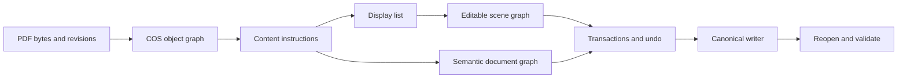

# Architecture

Wellfriend uses one canonical engine. Bindings and tools call the same parser, writer, renderer, semantic analysis, transaction, and validation paths.

## Representation stack

1. Byte and revision provenance identifies where a fact came from.
2. COS objects preserve object identity and page-tree ownership.
3. Content instructions expose source operators and operands.
4. Display lists provide renderable geometry.
5. Scene nodes provide editable local objects with invalidation regions.
6. Semantic graph reconstructs paragraphs, tables, forms, annotations, OCR layers, and document flow.
7. Operation reports record read/write sets, changed pages, validation, and inverse data.

The product guarantee is that supported edits are implemented through this stack, then serialized through the canonical writer and reopened for verification.
