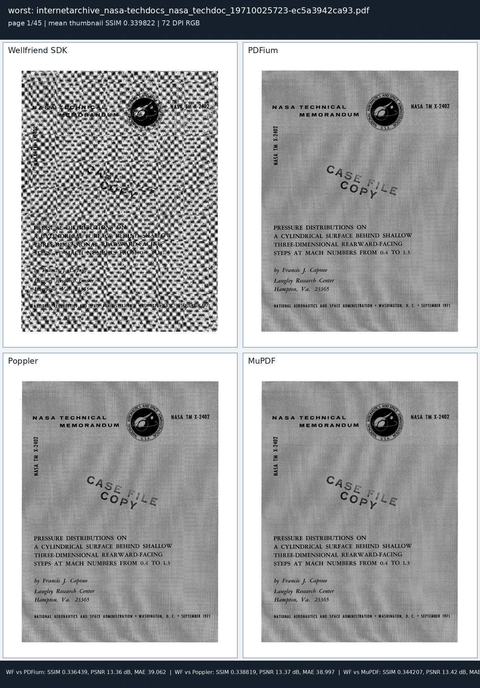
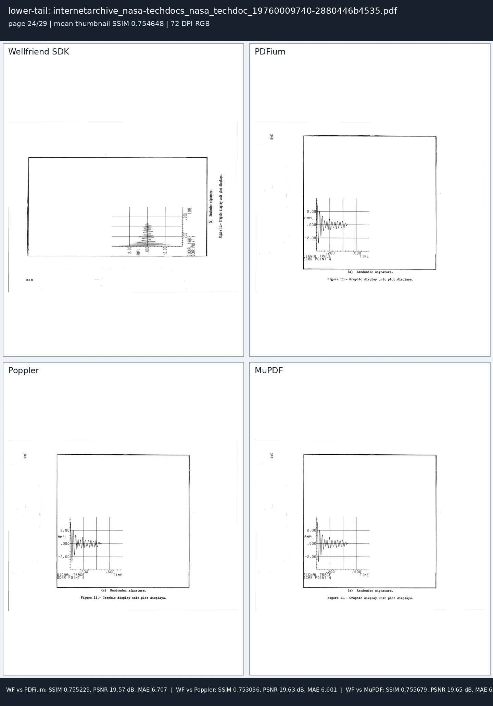
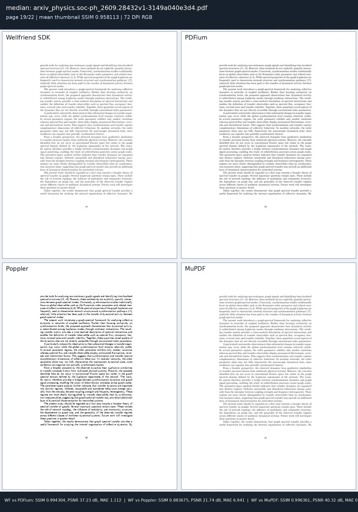
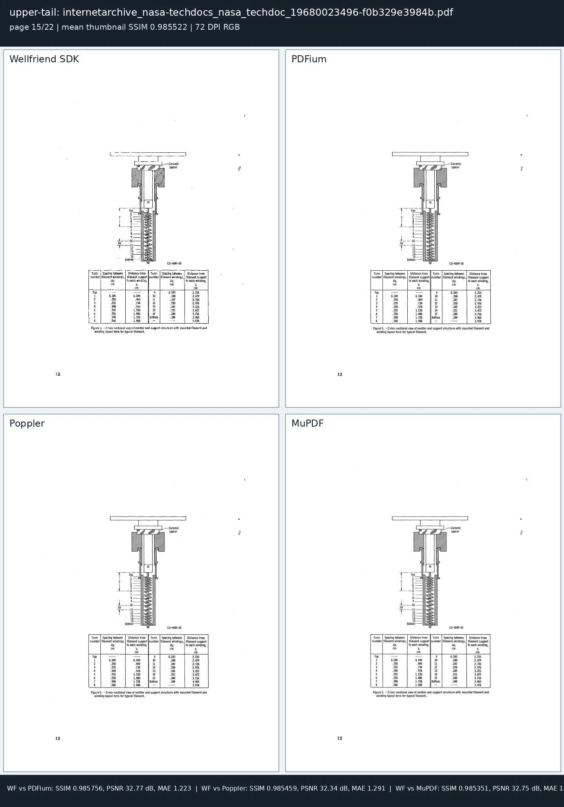

# 150-document comprehensive PDF benchmark

This report contains observed VPS results for the exact corpus and binaries named in the raw evidence. Unsupported cells are not timed as no-op successes. A successful command counts only after its artifact-specific postconditions pass.

## Corpus and contracts

- PDFs: **150** unique real-world files.
- Corpus bytes: **2.036 GiB**.
- Large-file partition: **50 files**.
- Structural outputs: qpdf reopen/check, resolved page count, encryption/linearization state, and low-resolution visual postconditions.
- Conversion quality: container/schema validity and token agreement with Poppler extraction. Agreement is not ground-truth semantic accuracy.
- Rendering timing: open once, render every page to RGB8 PPM frames, drain without retaining rasters.
- Rendering fidelity: every rendered page receives thumbnail metrics; first/middle/last pages receive full-resolution metrics.
- Editing: save, qpdf reopen, Wellfriend re-extraction, replacement postcondition, and before/after rendering.

## Reproducibility

- Host: `v72937`
- Platform: `Linux-7.0.0-31-generic-x86_64-with-glibc2.43`
- Start (UTC): `2026-10-03T07:10:03Z`
- Parser contract: `document open plus resolved page count`
- Corpus-manifest SHA-256: `c5c357d38acd2a46e271ce42998abfc414811d9741ffd72c964ce2ced59e931d`

| Adapter | SHA-256 |
| --- | --- |
| MuPDF | `55f6961d911b559488462b37d687faf71b3805ea5f66f7e5adf958c7dc8bd59f` |
| PDFium | `ed0f75e9d1df4a7ad42aa2a8c28f10daedcba4264767b882970ec63e126deb5f` |
| Poppler | `932fcaa6b6edf72f1b016449d54a7ee3e57671a1cd9eebaba08af375a956deee` |
| qpdf | `fdcbb4c6de1e9d0456facd8737adddecb0b40ef1af15049a599793f596a600f9` |
| Wellfriend SDK | `f873c9bfbcfb329bb4c9635817f47e2d97a70d1088f2ba2f830da4aece609df7` |

- Wellfriend source commit: `3d9062b1508ed56acad8c49a4b09440bc59c2e8a`
- Logical CPUs visible: **4**
- Scheduling: `ionice class 2 priority 0; nice -5; engines sequential per document; seeded randomized engine order`
- Host isolation: **shared VPS; unrelated services and occasional build activity remained active**

| Tool | Version |
| --- | --- |
| Wellfriend SDK | commit 3d9062b1508ed56acad8c49a4b09440bc59c2e8a |
| PDFium | 150.0.7857.0 (chromium/7857) |
| Poppler | 26.01.0 |
| MuPDF | 1.27.0 |
| qpdf | 12.3.2 |
| veraPDF | 1.30.2 |
| Ghostscript | 10.06.0 |
| OpenJDK | 25.0.4.1 |

| Benchmark binary | SHA-256 |
| --- | --- |
| wellfriend CLI | `07aefd99a960f6be5be76a04012d9321e33fd7c5806471fdc9f56eff1d713bc6` |
| Wellfriend SDK operation adapter | `a6b3f8a5efaa6e111bd4eb29e736437a0f670de369f10c7f95555e9037a4a8a3` |
| Wellfriend render stream | `60cdd75ecb5ec5fa867589818224791b3c20e765b54dfbfba8c74fa0228b5efd` |
| PDFium render stream | `e51d195ddcc47fdddff2aeef8330ad3b52dda52457a7cd9ab9bca13e84c3f480` |
| Poppler render stream | `616052bc24491a36ef5e94869a9d2326fc41adc04460bec3448ea29e358e42e9` |
| MuPDF render stream | `48c3292499a78fb18a73e3e39480b837dfda8ac1b1a5711837386cae1f07707c` |
| PDFium shared library | `3f3af4e4ba46bec9d0d11c5635262663b7020345ff4bed7eee85e883e2ce8455` |

The VPS was shared with unrelated services and occasional build activity. Engines ran sequentially in a seeded randomized order, but these timings are not laboratory-isolated and should be reproduced on a dedicated host before making competitive speed claims.

## Matched parsing: document open + resolved page count

| Benchmark | Wellfriend SDK | PDFium | Poppler | MuPDF | qpdf |
| --- | --- | --- | --- | --- | --- |
| Qualified page counts | 150/150 | 150/150 | 150/150 | 150/150 | 150/150 |
| Resident P50 | 0.93 ms | 0.57 ms | 2.71 ms | 2.38 ms | 3.46 ms |
| Resident P90 | 2.05 ms | 1.25 ms | 4.60 ms | 9.76 ms | 15.49 ms |
| Resident P95 | 2.69 ms | 1.68 ms | 5.23 ms | 101.30 ms | 22.76 ms |
| Resident P99 | 11.35 ms | 4.56 ms | 10.85 ms | 439.74 ms | 44.81 ms |
| Resident maximum | 29.75 ms | 31.58 ms | 14.77 ms | 675.27 ms | 60.67 ms |
| Fresh-process P50 | 14.31 ms | 15.29 ms | 45.54 ms | 25.96 ms | 37.58 ms |
| Fresh-process P95 | 88.64 ms | 135.67 ms | 161.53 ms | 247.40 ms | 158.23 ms |
| Fresh-process maximum | 797.67 ms | 493.07 ms | 619.09 ms | 2,131.84 ms | 637.02 ms |

Page-count disagreements: **0**.

## Structural and security operations

| Benchmark | Wellfriend SDK | PDFium | Poppler | MuPDF | qpdf |
| --- | --- | --- | --- | --- | --- |
| merge — result | 143/150 pass; 7 failed | Unsupported / not applicable | 150/150 pass | 143/150 pass; 7 failed | 150/150 pass |
| merge — P50 | 200.68 ms | — | 613.10 ms | 112.76 ms | 95.39 ms |
| merge — P95 | 2,801.25 ms | — | 10,367.91 ms | 1,293.87 ms | 1,016.88 ms |
| merge — maximum | 14,240.95 ms | — | 47,297.68 ms | 8,122.81 ms | 2,929.39 ms |
| split — result | 141/150 pass; 9 failed | Unsupported / not applicable | 147/150 pass; 3 failed | 141/150 pass; 9 failed | 150/150 pass |
| split — P50 | 69.83 ms | — | 294.54 ms | 47.17 ms | 44.83 ms |
| split — P95 | 648.12 ms | — | 1,591.59 ms | 94.18 ms | 260.99 ms |
| split — maximum | 2,574.07 ms | — | 9,739.50 ms | 152.86 ms | 1,060.93 ms |
| extract-pages — result | 141/150 pass; 9 failed | Unsupported / not applicable | 150/150 pass | 141/150 pass; 9 failed | 150/150 pass |
| extract-pages — P50 | 75.57 ms | — | 530.78 ms | 26.30 ms | 46.95 ms |
| extract-pages — P95 | 588.57 ms | — | 2,841.89 ms | 51.21 ms | 245.51 ms |
| extract-pages — maximum | 2,423.81 ms | — | 10,341.59 ms | 81.14 ms | 956.95 ms |
| lock — result | 150/150 pass | Unsupported / not applicable | Unsupported / not applicable | 150/150 pass | 150/150 pass |
| lock — P50 | 198.12 ms | — | — | 113.79 ms | 129.29 ms |
| lock — P95 | 2,103.24 ms | — | — | 1,280.74 ms | 1,088.45 ms |
| lock — maximum | 8,549.20 ms | — | — | 5,242.56 ms | 3,844.46 ms |
| unlock — result | 150/150 pass | Unsupported / not applicable | Unsupported / not applicable | 150/150 pass | 150/150 pass |
| unlock — P50 | 159.21 ms | — | — | 169.48 ms | 135.53 ms |
| unlock — P95 | 1,538.82 ms | — | — | 1,286.16 ms | 1,062.11 ms |
| unlock — maximum | 6,660.57 ms | — | — | 5,997.46 ms | 5,379.18 ms |
| rotate — result | 150/150 pass | Unsupported / not applicable | Unsupported / not applicable | Unsupported / not applicable | 150/150 pass |
| rotate — P50 | 128.98 ms | — | — | — | 79.51 ms |
| rotate — P95 | 2,088.02 ms | — | — | — | 787.92 ms |
| rotate — maximum | 19,742.54 ms | — | — | — | 2,295.68 ms |
| repair — result | 56/150 pass; 94 failed | Unsupported / not applicable | Unsupported / not applicable | 150/150 pass | 150/150 pass |
| repair — P50 | 45.64 ms | — | — | 65.77 ms | 373.06 ms |
| repair — P95 | 672.18 ms | — | — | 881.89 ms | 8,778.93 ms |
| repair — maximum | 4,187.74 ms | — | — | 1,924.60 ms | 28,085.02 ms |
| organize — result | 141/150 pass; 9 failed | Unsupported / not applicable | 150/150 pass | 141/150 pass; 9 failed | 150/150 pass |
| organize — P50 | 70.37 ms | — | 580.25 ms | 25.38 ms | 49.25 ms |
| organize — P95 | 675.07 ms | — | 2,565.59 ms | 57.23 ms | 385.00 ms |
| organize — maximum | 2,636.32 ms | — | 11,279.76 ms | 83.06 ms | 1,369.63 ms |
| linearize — result | 132/150 pass; 16 refused; 2 failed | Unsupported / not applicable | Unsupported / not applicable | Unsupported / not applicable | 150/150 pass |
| linearize — P50 | 133.89 ms | — | — | — | 105.27 ms |
| linearize — P95 | 1,732.50 ms | — | — | — | 901.26 ms |
| linearize — maximum | 8,635.06 ms | — | — | — | 4,509.24 ms |
| flatten — result | 143/150 pass; 7 failed | Unsupported / not applicable | Unsupported / not applicable | Unsupported / not applicable | 149/150 pass; 1 failed |
| flatten — P50 | 102.61 ms | — | — | — | 77.39 ms |
| flatten — P95 | 922.03 ms | — | — | — | 690.33 ms |
| flatten — maximum | 5,395.57 ms | — | — | — | 2,225.03 ms |
| watermark — result | 150/150 pass | Unsupported / not applicable | Unsupported / not applicable | Unsupported / not applicable | Unsupported / not applicable |
| watermark — P50 | 141.63 ms | — | — | — | — |
| watermark — P95 | 1,683.77 ms | — | — | — | — |
| watermark — maximum | 6,932.17 ms | — | — | — | — |
| page-numbers — result | 150/150 pass | Unsupported / not applicable | Unsupported / not applicable | Unsupported / not applicable | Unsupported / not applicable |
| page-numbers — P50 | 137.55 ms | — | — | — | — |
| page-numbers — P95 | 1,487.05 ms | — | — | — | — |
| page-numbers — maximum | 6,798.59 ms | — | — | — | — |
| metadata — result | 150/150 pass | Unsupported / not applicable | Unsupported / not applicable | Unsupported / not applicable | Unsupported / not applicable |
| metadata — P50 | 103.66 ms | — | — | — | — |
| metadata — P95 | 1,950.03 ms | — | — | — | — |
| metadata — maximum | 9,030.31 ms | — | — | — | — |
| crop — result | 150/150 pass | Unsupported / not applicable | Unsupported / not applicable | Unsupported / not applicable | Unsupported / not applicable |
| crop — P50 | 116.27 ms | — | — | — | — |
| crop — P95 | 1,248.45 ms | — | — | — | — |
| crop — maximum | 6,157.00 ms | — | — | — | — |
| resize — result | 142/150 pass; 2 refused; 6 failed | Unsupported / not applicable | Unsupported / not applicable | Unsupported / not applicable | Unsupported / not applicable |
| resize — P50 | 309.84 ms | — | — | — | — |
| resize — P95 | 1,110.71 ms | — | — | — | — |
| resize — maximum | 2,632.63 ms | — | — | — | — |
| nup — result | 141/150 pass; 2 refused; 7 failed | Unsupported / not applicable | Unsupported / not applicable | Unsupported / not applicable | Unsupported / not applicable |
| nup — P50 | 516.97 ms | — | — | — | — |
| nup — P95 | 1,871.41 ms | — | — | — | — |
| nup — maximum | 2,437.79 ms | — | — | — | — |
| optimize — result | 150/150 pass | Unsupported / not applicable | Unsupported / not applicable | 149/150 pass; 1 failed | 150/150 pass |
| optimize — P50 | 137.56 ms | — | — | 84.92 ms | 1,417.82 ms |
| optimize — P95 | 2,012.35 ms | — | — | 7,222.11 ms | 14,460.75 ms |
| optimize — maximum | 6,999.91 ms | — | — | 230,110.89 ms | 43,002.65 ms |
| canonicalize — result | 150/150 pass | Unsupported / not applicable | Unsupported / not applicable | 150/150 pass | 150/150 pass |
| canonicalize — P50 | 193.92 ms | — | — | 60.72 ms | 316.90 ms |
| canonicalize — P95 | 3,246.42 ms | — | — | 458.36 ms | 3,195.88 ms |
| canonicalize — maximum | 16,129.50 ms | — | — | 1,802.37 ms | 10,958.07 ms |
| sanitize — result | 150/150 pass | Unsupported / not applicable | Unsupported / not applicable | Unsupported / not applicable | Unsupported / not applicable |
| sanitize — P50 | 186.73 ms | — | — | — | — |
| sanitize — P95 | 2,530.53 ms | — | — | — | — |
| sanitize — maximum | 11,261.01 ms | — | — | — | — |
| sign — result | 138/150 pass; 12 failed | Unsupported / not applicable | 150/150 pass | Unsupported / not applicable | Unsupported / not applicable |
| sign — P50 | 177.62 ms | — | 115.91 ms | — | — |
| sign — P95 | 3,249.96 ms | — | 879.58 ms | — | — |
| sign — maximum | 13,436.36 ms | — | 3,808.64 ms | — | — |

### Signature interoperability

| Signature producer | Outputs | Poppler verification pass | Wellfriend verification pass |
| --- | --- | --- | --- |
| Wellfriend SDK | 150 | 138 | 138 |
| Poppler | 150 | 150 | 0 |

Producer success requires a structurally valid, visually preserved PDF and successful Poppler verification. Wellfriend verification is also mandatory for Wellfriend-produced signatures and is recorded as an interoperability observation for Poppler-produced signatures. Poppler verifies all 150 Poppler-produced signatures, while Wellfriend rejects those same signatures because its verifier reports `CMS ContentInfo uses forbidden indefinite DER length`; this is an observed verifier-compatibility gap, not evidence that Poppler produced 150 invalid signatures.

## PDF conversion and extraction

| Benchmark | Wellfriend SDK | PDFium | Poppler | MuPDF | qpdf |
| --- | --- | --- | --- | --- | --- |
| text — result | 139/150 pass; 11 failed | Unsupported / not applicable | 150/150 pass | 149/150 pass; 1 failed | Unsupported / not applicable |
| text — P50 | 226.53 ms | — | 175.57 ms | 147.37 ms | — |
| text — P95 | 1,433.46 ms | — | 1,511.34 ms | 943.66 ms | — |
| text — maximum | 7,574.37 ms | — | 24,268.90 ms | 6,402.92 ms | — |
| html — result | 150/150 pass | Unsupported / not applicable | 150/150 pass | 150/150 pass | Unsupported / not applicable |
| html — P50 | 427.64 ms | — | 183.05 ms | 158.88 ms | — |
| html — P95 | 4,700.63 ms | — | 1,568.00 ms | 1,160.73 ms | — |
| html — maximum | 20,111.70 ms | — | 10,497.20 ms | 8,167.89 ms | — |
| markdown — result | 150/150 pass | Unsupported / not applicable | Unsupported / not applicable | Unsupported / not applicable | Unsupported / not applicable |
| markdown — P50 | 420.80 ms | — | — | — | — |
| markdown — P95 | 4,263.49 ms | — | — | — | — |
| markdown — maximum | 18,983.43 ms | — | — | — | — |
| json — result | 150/150 pass | Unsupported / not applicable | Unsupported / not applicable | Unsupported / not applicable | Unsupported / not applicable |
| json — P50 | 420.01 ms | — | — | — | — |
| json — P95 | 4,222.46 ms | — | — | — | — |
| json — maximum | 19,829.89 ms | — | — | — | — |
| docx — result | 150/150 pass | Unsupported / not applicable | Unsupported / not applicable | Unsupported / not applicable | Unsupported / not applicable |
| docx — P50 | 1,066.96 ms | — | — | — | — |
| docx — P95 | 21,894.40 ms | — | — | — | — |
| docx — maximum | 552,000.19 ms | — | — | — | — |
| pptx — result | 131/150 pass; 19 failed | Unsupported / not applicable | Unsupported / not applicable | Unsupported / not applicable | Unsupported / not applicable |
| pptx — P50 | 950.65 ms | — | — | — | — |
| pptx — P95 | 21,401.25 ms | — | — | — | — |
| pptx — maximum | 533,463.14 ms | — | — | — | — |
| xlsx — result | 150/150 pass | Unsupported / not applicable | Unsupported / not applicable | Unsupported / not applicable | Unsupported / not applicable |
| xlsx — P50 | 449.16 ms | — | — | — | — |
| xlsx — P95 | 3,708.63 ms | — | — | — | — |
| xlsx — maximum | 19,205.99 ms | — | — | — | — |
| svg-first-page — result | 142/150 pass; 2 refused; 6 failed | Unsupported / not applicable | Unsupported / not applicable | 150/150 pass | Unsupported / not applicable |
| svg-first-page — P50 | 1,956.38 ms | — | — | 64.71 ms | — |
| svg-first-page — P95 | 10,959.20 ms | — | — | 1,003.18 ms | — |
| svg-first-page — maximum | 99,532.68 ms | — | — | 1,446.30 ms | — |
| postscript-first-page — result | 142/150 pass; 2 refused; 6 failed | Unsupported / not applicable | 150/150 pass | Unsupported / not applicable | Unsupported / not applicable |
| postscript-first-page — P50 | 1,963.48 ms | — | 99.04 ms | — | — |
| postscript-first-page — P95 | 10,867.13 ms | — | 1,020.12 ms | — | — |
| postscript-first-page — maximum | 101,079.76 ms | — | 1,629.07 ms | — | — |
| eps-first-page — result | 142/150 pass; 2 refused; 6 failed | Unsupported / not applicable | 150/150 pass | Unsupported / not applicable | Unsupported / not applicable |
| eps-first-page — P50 | 2,683.94 ms | — | 102.32 ms | — | — |
| eps-first-page — P95 | 10,963.38 ms | — | 886.52 ms | — | — |
| eps-first-page — maximum | 105,338.65 ms | — | 1,552.39 ms | — | — |
| png-first-page — result | 142/150 pass; 2 refused; 6 failed | Unsupported / not applicable | 150/150 pass | 150/150 pass | Unsupported / not applicable |
| png-first-page — P50 | 268.38 ms | — | 302.99 ms | 100.44 ms | — |
| png-first-page — P95 | 1,072.07 ms | — | 668.84 ms | 289.37 ms | — |
| png-first-page — maximum | 2,837.75 ms | — | 1,795.67 ms | 451.53 ms | — |
| jpeg-first-page — result | 142/150 pass; 2 refused; 6 failed | Unsupported / not applicable | 150/150 pass | Unsupported / not applicable | Unsupported / not applicable |
| jpeg-first-page — P50 | 257.88 ms | — | 123.07 ms | — | — |
| jpeg-first-page — P95 | 960.74 ms | — | 290.18 ms | — | — |
| jpeg-first-page — maximum | 2,220.50 ms | — | 745.02 ms | — | — |
| tables-json — result | 139/150 pass; 11 failed | Unsupported / not applicable | Unsupported / not applicable | Unsupported / not applicable | Unsupported / not applicable |
| tables-json — P50 | 368.72 ms | — | — | — | — |
| tables-json — P95 | 1,994.03 ms | — | — | — | — |
| tables-json — maximum | 102,406.56 ms | — | — | — | — |

### Conversion quality observations

| Conversion | Tool | Scored files | Token F1 P50 | Token F1 P05 | Token F1 minimum |
| --- | --- | --- | --- | --- | --- |
| text | Wellfriend SDK | 138 | 0.949786 | 0.689273 | 0.290788 |
| text | Poppler | 149 | 1.000000 | 1.000000 | 1.000000 |
| text | MuPDF | 149 | 0.972429 | 0.868778 | 0.326319 |
| html | Wellfriend SDK | 149 | 0.911545 | 0.289598 | 0.000742 |
| html | Poppler | 149 | 0.886217 | 0.011338 | 0.008048 |
| html | MuPDF | 149 | 0.960763 | 0.597691 | 0.066667 |
| markdown | Wellfriend SDK | 149 | 0.912882 | 0.289601 | 0.000857 |
| json | Wellfriend SDK | 149 | 0.417040 | 0.086289 | 0.001963 |
| docx | Wellfriend SDK | 149 | 0.915484 | 0.290343 | 0.000742 |
| pptx | Wellfriend SDK | 130 | 0.924338 | 0.290610 | 0.000742 |
| xlsx | Wellfriend SDK | 149 | 0.915145 | 0.289638 | 0.000742 |

| Raster conversion | Tool | Decoded images |
| --- | --- | --- |
| png-first-page | Wellfriend SDK | 142/150 |
| png-first-page | Poppler | 150/150 |
| png-first-page | MuPDF | 150/150 |
| jpeg-first-page | Wellfriend SDK | 142/150 |
| jpeg-first-page | Poppler | 150/150 |

Token scores measure agreement with Poppler text extraction, not semantic ground truth. Raster-conversion rows verify image decoding and dimensions; cross-renderer pixel fidelity is reported separately below.

## PDF/A validation and conversion

| Benchmark | Wellfriend SDK | veraPDF | Ghostscript |
| --- | --- | --- | --- |
| pdfa-2b-validation — execution result | 150/150 pass | 150/150 pass | — |
| pdfa-2b-validation — P50 | 158.66 ms | 5,876.80 ms | — |
| pdfa-2b-validation — P95 | 1,168.06 ms | 7,659.53 ms | — |
| pdfa-2b-conversion — result | 7/150 pass; 143 refused | — | 0/150 pass; 150 failed |
| pdfa-2b-conversion — P50 | 73.53 ms | — | 2,896.65 ms |
| pdfa-2b-conversion — P95 | 407.55 ms | — | 54,321.61 ms |

| Validator | Files with outcome | Reported compliant | Reported non-compliant |
| --- | --- | --- | --- |
| Wellfriend SDK | 0 | 0 | 0 |
| veraPDF | 150 | 0 | 150 |

A validation execution pass means the command completed and its report artifact passed the harness checks; it does not mean the input is PDF/A-compliant. The Wellfriend rows did not expose a machine-parsed compliance boolean, so no Wellfriend compliance claim is made. veraPDF classified all 150 source PDFs as non-compliant.

| Converter | Outputs assessed | veraPDF compliant | veraPDF non-compliant |
| --- | --- | --- | --- |
| Wellfriend SDK | 15 | 7 | 8 |
| Ghostscript | 150 | 0 | 150 |

veraPDF is the independent PDF/A validator; Ghostscript is included only as a conversion baseline, not as one of the five requested PDF engines.

## Visual rendering

| Benchmark | Wellfriend SDK | PDFium | Poppler | MuPDF |
| --- | --- | --- | --- | --- |
| Process exits passed | 135/150 | 150/150 | 150/150 | 150/150 |
| Complete documents | 135/150 | 150/150 | 150/150 | 150/150 |
| Pages emitted / expected | 3,649/9,214 | 9,214/9,214 | 9,214/9,214 | 9,214/9,214 |
| Document P50 | 6,625.17 ms | 1,094.97 ms | 1,677.90 ms | 859.82 ms |
| Document P95 | 35,843.16 ms | 19,576.46 ms | 27,410.22 ms | 10,896.49 ms |
| Document maximum | 116,982.51 ms | 161,934.23 ms | 135,353.68 ms | 76,835.76 ms |
| Per-page P50 | 284.43 ms | 44.64 ms | 78.66 ms | 45.41 ms |
| Per-page P95 | 748.04 ms | 189.00 ms | 204.39 ms | 130.77 ms |
| Per-page maximum | 2,739.53 ms | 318.99 ms | 753.05 ms | 255.38 ms |

Timing distributions include only complete documents whose emitted page count exactly matches the qpdf page inventory. Process-exit success is shown separately because a zero exit code can still accompany a truncated page stream.

| Comparison | Pages | Thumbnail SSIM P50 | Thumbnail SSIM P05 | Thumbnail PSNR P50 | Full-res samples | Full-res SSIM P50 |
| --- | --- | --- | --- | --- | --- | --- |
| Wellfriend vs PDFium | 3596 | 0.979152 | 0.730618 | 31.420 | 383 | 0.912894 |
| Wellfriend vs Poppler | 3596 | 0.918150 | 0.700735 | 24.173 | 235 | 0.771167 |
| Wellfriend vs MuPDF | 3596 | 0.982698 | 0.730095 | 32.557 | 383 | 0.928404 |

Documents with complete three-reference quality passes: **135/150**.

### Wellfriend public CLI coverage check

Default display-list pipeline: **135/150 files**, **3649/3664 attempted pages**, with **15 failed files**.

Immediate-pipeline retry of the failed set: **0/15 files**, **53/68 attempted pages**.

### Distribution-selected visual evidence

These sheets are selected reproducibly from successful three-reference page pairs: worst, lower-tail, median, and upper-tail by mean thumbnail SSIM. They supplement rather than replace the all-page metrics and do not include the 15 documents with terminal Wellfriend render failures.

**worst** — `internetarchive_nasa-techdocs_nasa_techdoc_19710025723-ec5a3942ca93.pdf`, page 1/45, mean thumbnail SSIM **0.339822**.

**lower-tail** — `internetarchive_nasa-techdocs_nasa_techdoc_19760009740-2880446b4535.pdf`, page 24/29, mean thumbnail SSIM **0.754648**.

**median** — `arxiv_physics.soc-ph_2609.28432v1-3149a040e3d4.pdf`, page 19/22, mean thumbnail SSIM **0.958113**.

**upper-tail** — `internetarchive_nasa-techdocs_nasa_techdoc_19680023496-f0b329e3984b.pdf`, page 15/22, mean thumbnail SSIM **0.985522**.

qpdf is shown as unsupported for visual rendering because it is a structural PDF transformer, not a raster renderer.

## Wellfriend source-editing qualification

| Edit route | Files | Pass | Typed refusal | Fail | No source | Edit postcondition verified | Visual change | P50 | P95 |
| --- | --- | --- | --- | --- | --- | --- | --- | --- | --- |
| operator-preserving | 150 | 30 | 59 | 46 | 15 | 30 | 29 | 949.68 ms | 2,863.52 ms |
| scene-source-edit | 150 | 3 | 0 | 132 | 15 | 3 | 3 | 861.02 ms | 2,672.70 ms |
| paragraph-reflow | 150 | 0 | 0 | 135 | 15 | 0 | 0 | 21.06 ms | 31.30 ms |
| paragraph-reflow-sdk | 150 | 10 | 40 | 85 | 15 | 10 | 10 | 510.33 ms | 3,169.87 ms |
| geometric-reflow | 150 | 0 | 118 | 17 | 15 | 0 | 0 | 1,382.96 ms | 3,590.29 ms |
| semantic-reflow | 150 | 0 | 134 | 1 | 15 | 0 | 0 | 9,047.52 ms | 41,683.05 ms |
| vector-duplicate | 150 | 54 | 8 | 35 | 53 | 89 | 54 | 244.99 ms | 4,057.20 ms |

## Failure ledger

| Phase | Operation | Count | Observed reason |
| --- | --- | --- | --- |
| editing | paragraph-reflow | 135 | wellfriendpdf: parse/format error: parse error: unknown execution mode 'paragraph-reflow'; expected 'standard' or 'research' |
| editing | semantic-reflow | 134 | wellfriendpdf: unsupported feature: unsupported feature: text_reflow paragraph_not_resolved: SemanticDocument local application requires exactly one page-local semantic paragraph whose exact text matches the provenance-resolved source selec |
| editing | scene-source-edit | 129 | wellfriendpdf: parse/format error: parse error: editing_transactions prepared operator plan does not match the apply request |
| editing | geometric-reflow | 108 | wellfriendpdf: unsupported feature: unsupported feature: text_reflow "source_not_resolved": "requested text could not be linked to SourceEditing source instructions" |
| pdfa-conversion | pdfa-2b-conversion | 78 |  not permitted in PDF/A, annotation will not be present in output file |
| structural | repair | 77 | wellfriendpdf: parse/format error: malformed PDF: xref stream object 1 0 is not /Type /XRef |
| editing | operator-preserving | 56 | wellfriendpdf: unsupported feature: unsupported feature: source_editing source_not_resolved: no source text operator resolved for the requested selection |
| pdfa-conversion | pdfa-2b-conversion | 51 | Error: UnsupportedFeature("PDF/A conversion blocked: source fonts are not embedded (Courier, Courier-Bold, Courier-BoldOblique, Courier-Oblique, Helvetica, Helvetica-Bold, Helvetica-BoldOblique, Helvetica-Oblique, Times-Bold, Times-BoldItal |
| pdfa-conversion | pdfa-2b-conversion | 48 | fail |
| editing | operator-preserving | 46 | wellfriendpdf: parse/format error: malformed PDF: advanced_editing same-width patch failed reopen/extraction/prefix verification |
| editing | paragraph-reflow-sdk | 43 | Error: MalformedPdf("text extraction: missing XObject /ArXivWatermark in current scope") |
| editing | vector-duplicate | 35 | fail |
| editing | paragraph-reflow-sdk | 32 | Error: UnsupportedFeature("paragraph reflow overflow: rewritten paragraph exceeds 1 line(s)") |
| editing | paragraph-reflow-sdk | 27 | fail |
| structural | split | 21 | fail |
| conversion | pptx | 19 | wellfriendpdf: parse/format error: malformed PDF: page_number is 1-indexed; 0 is invalid |
| structural | organize | 18 | fail |
| structural | extract-pages | 18 | fail |
| structural | linearize | 16 | wellfriendpdf: unsupported feature: unsupported feature: linearize: qpdf-valid output for page thumbnails is still deferred |
| structural | merge | 14 | fail |
| pdfa-conversion | pdfa-2b-conversion | 14 |    **** specification. |
| structural | sign | 12 | wellfriendpdf: parse/format error: malformed PDF: post-sign validation failed: the generated signature is not mathematically valid over the signed bytes |
| pdfa-conversion | pdfa-2b-conversion | 10 | Error: UnsupportedFeature("PDF/A conversion blocked: source fonts are not embedded (ZapfDingbats)") |
| pdfa-conversion | pdfa-2b-conversion | 8 | typed_refusal |
| editing | vector-duplicate | 8 | wellfriendpdf: unsupported feature: unsupported feature: advanced_editing vector is owned by a Form XObject; select shared_form_policy edit_all_uses or clone_edit_one_instance explicitly |
| structural | flatten | 7 | fail |
| conversion | jpeg-first-page | 6 | fail |
| conversion | png-first-page | 6 | fail |
| editing | geometric-reflow | 6 | wellfriendpdf: unsupported feature: unsupported feature: advanced_editing bounded reflow requires old text in exactly one PDF string token; found 2 occurrences |
| editing | paragraph-reflow-sdk | 6 | Error: MalformedPdf("content stream ends with unconsumed operands or open containers") |

## Evidence files

Raw JSON/JSONL files beside this report are authoritative. This Markdown is a deterministic aggregation and does not replace the per-file records.
