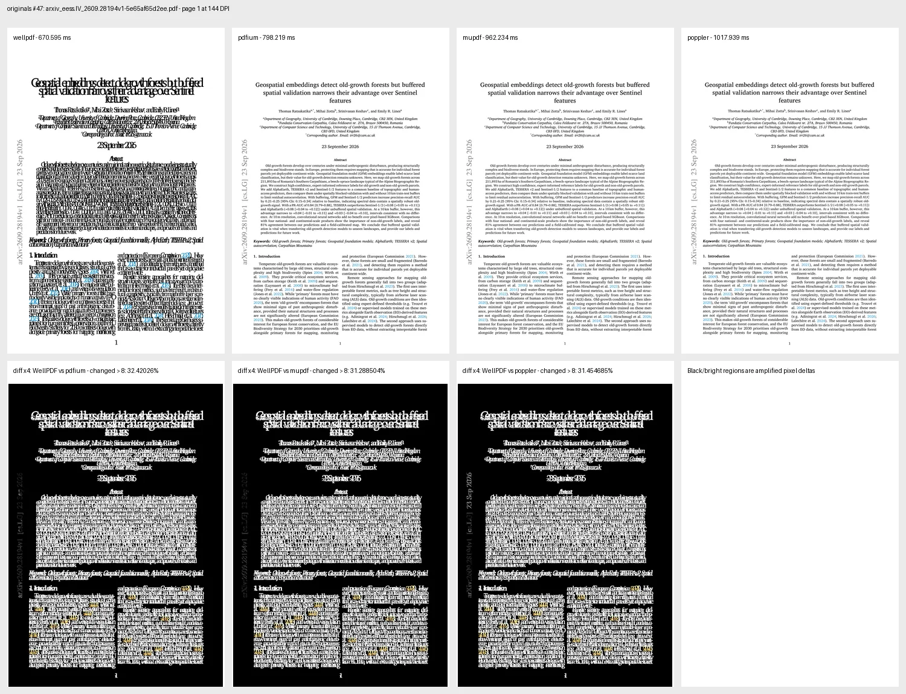
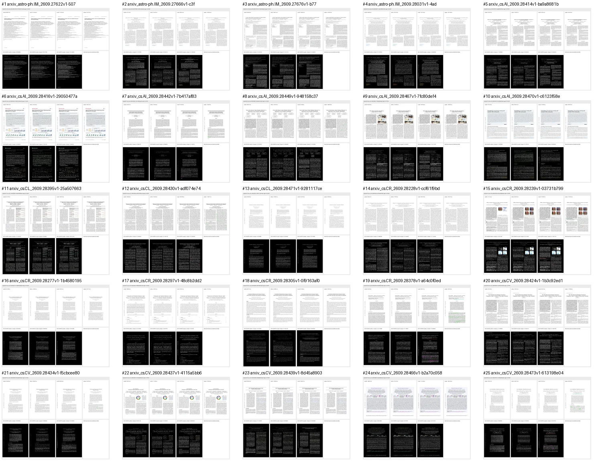
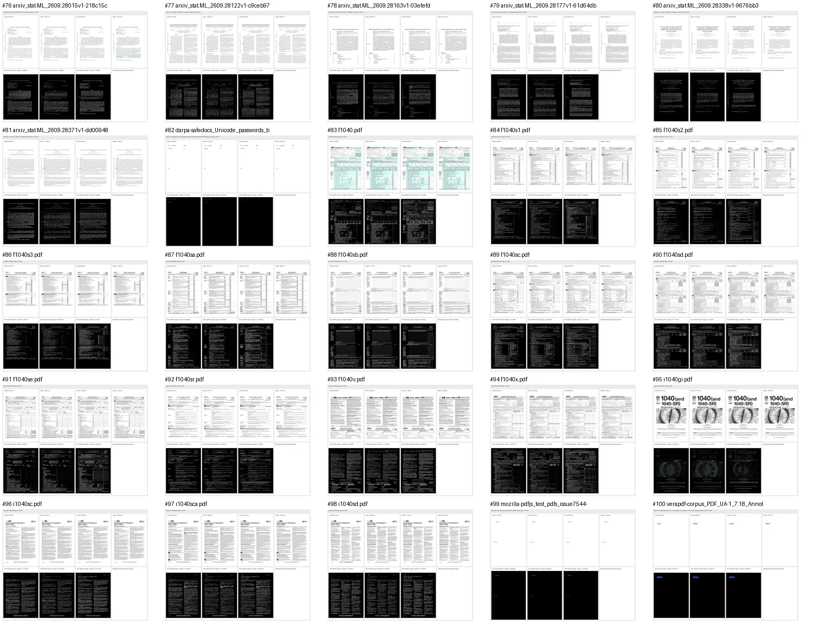

# WellPDF cross-renderer visual evidence - 2026-09-29 IST

## Blunt verdict

The retained visual campaign rendered page one of 100 original PDFs and 100
verified edited outputs with WellPDF, PDFium, MuPDF, and Poppler at 144 DPI.
All 200 comparison pipelines completed and all 600 reference comparisons had
matching dimensions.

That is an operational result, not a 100/100 visual-fidelity result. The
maximum-divergence document is visibly wrong in WellPDF: text is repeatedly
overprinted while PDFium, MuPDF, and Poppler produce consistent layouts.

The worst original page differs from PDFium on 32.420260% of pixels, Poppler on
31.454685%, and MuPDF on 31.288504% under the `changed > 8` metric. The edited
version has the same failure shape. This evidence therefore disproves any claim
that the current renderer achieved 100/100 visual correctness.

## Execution identity and timestamps

| Item | Value |
|---|---|
| VPS | `2a0e:97c0:711:3bc::1` |
| Qualified implementation | `e2a83fc3d16b4f6b820d632102e83bfa608e8b5d` |
| Release binary SHA-256 | `879e2bc695790fc7523cf6a835b7149b2d6b7ee7a6dd542466930ecb18f83943` |
| Originals UTC interval | `2026-09-28T20:42:59Z` to `2026-09-28T20:50:08Z` |
| Edited UTC interval | `2026-09-28T20:50:39Z` to `2026-09-28T20:57:46Z` |
| Originals IST interval | `2026-09-29T02:12:59+05:30` to `2026-09-29T02:20:08+05:30` |
| Edited IST interval | `2026-09-29T02:20:39+05:30` to `2026-09-29T02:27:46+05:30` |
| Resolution and workers | 144 DPI, four workers |
| PDFium | PDFium `153.0.7999.0` through pypdfium2 `5.13.0` |
| MuPDF | MuPDF/PyMuPDF `1.27.1` |
| Poppler | `pdftoppm 26.01.0` |
| Pillow | `12.3.0` |
| Compressed VPS evidence SHA-256 | `b7e4616b019bd53446bf4a9d0a4d8de39a9a5364232a72c06d0e98a57a6e3614` |

## Operational coverage

`Pipeline complete` means all four engines returned a page, dimensions matched,
metrics were calculated, and a labeled comparison artifact was retained. It
does not mean that the page was visually correct.

| Corpus | PDFs | Pipeline complete | PDFium comparable | MuPDF comparable | Poppler comparable |
|---|---:|---:|---:|---:|---:|
| Originals | 100 | 100/100 | 100/100 | 100/100 | 100/100 |
| Edited outputs | 100 | 100/100 | 100/100 | 100/100 | 100/100 |

## Per-renderer latency

These are measured subprocess durations from the retained run. They are not a
claim that the engines expose identical APIs or perform identical internal
work.

| Corpus | Renderer | P50 | P90 | P95 | P99 | Maximum |
|---|---|---:|---:|---:|---:|---:|
| Originals | WellPDF | 495.160 ms | 773.481 ms | 997.802 ms | 1,489.815 ms | 40,854.901 ms |
| Originals | PDFium | 735.010 ms | 868.279 ms | 913.387 ms | 1,089.188 ms | 1,154.583 ms |
| Originals | MuPDF | 957.148 ms | 1,133.023 ms | 1,181.795 ms | 1,287.178 ms | 1,455.695 ms |
| Originals | Poppler | 900.829 ms | 1,146.898 ms | 1,168.173 ms | 1,393.087 ms | 1,634.043 ms |
| Edited | WellPDF | 490.340 ms | 813.415 ms | 1,164.499 ms | 1,546.844 ms | 39,961.103 ms |
| Edited | PDFium | 730.140 ms | 850.722 ms | 918.240 ms | 1,069.498 ms | 1,139.994 ms |
| Edited | MuPDF | 965.530 ms | 1,103.554 ms | 1,184.153 ms | 1,328.426 ms | 1,435.239 ms |
| Edited | Poppler | 923.954 ms | 1,146.064 ms | 1,217.007 ms | 1,280.089 ms | 1,788.012 ms |

The WellPDF maximum is a repeatable document-specific outlier: `i1040gi.pdf`
took 40,854.901 ms before editing and 39,961.103 ms afterward. The next-slowest
WellPDF observations were approximately 1.5 seconds. This outlier is visible in
the retained [original](originals/pages/095-i1040gi-pdf.webp) and
[edited](edited/pages/095-i1040gi-pdf.webp) sheets.

## Pixel-divergence distribution

`Changed > 8` is the percentage of pixels where at least one RGB channel
differs from the reference by more than eight. These are fidelity diagnostics,
not timing measurements and not a count of conclusively incorrect pixels.

| Corpus | Reference | Median | P90 | P95 | P99 | Maximum |
|---|---|---:|---:|---:|---:|---:|
| Originals | MuPDF | 8.379496% | 11.293026% | 11.791062% | 15.770450% | 31.288504% |
| Originals | Poppler | 9.161623% | 12.973691% | 13.444442% | 17.801277% | 31.454685% |
| Originals | PDFium | 10.087342% | 14.145231% | 14.624750% | 18.511040% | 32.420260% |
| Edited | MuPDF | 8.366498% | 11.277501% | 11.794105% | 15.751366% | 31.297379% |
| Edited | Poppler | 9.155820% | 12.949965% | 13.439491% | 17.781729% | 31.462513% |
| Edited | PDFium | 10.078393% | 14.142704% | 14.618561% | 18.493297% | 32.425445% |

The nearly unchanged original/edited distributions indicate that the qualified
edit workflow did not introduce a broad new rendering regression. They do not
show that the pre-existing renderer output is sufficiently faithful.

## Human-viewable evidence

Each retained per-page WebP contains:

1. the WellPDF raster;
2. the PDFium raster;
3. the MuPDF raster;
4. the Poppler raster; and
5. amplified WellPDF-to-reference difference maps for all three references.

Original contact sheets:

- [pages 1-25](originals/contacts/contact-001-025.webp)
- [pages 26-50](originals/contacts/contact-026-050.webp)
- [pages 51-75](originals/contacts/contact-051-075.webp)
- [pages 76-100](originals/contacts/contact-076-100.webp)
- [all 100 individual original comparisons](originals/pages/)

Edited-output contact sheets:

- [pages 1-25](edited/contacts/contact-001-025.webp)
- [pages 26-50](edited/contacts/contact-026-050.webp)
- [pages 51-75](edited/contacts/contact-051-075.webp)
- [pages 76-100](edited/contacts/contact-076-100.webp)
- [all 100 individual edited comparisons](edited/pages/)

## Machine-readable evidence

- [Original summary](originals/summary.json) and [per-file records](originals/results.jsonl)
- [Edited summary](edited/summary.json) and [per-file records](edited/results.jsonl)
- [Artifact hash manifest](artifact-manifest.sha256)
- [Reproducible harness](../../../scripts/publish_visual_render_evidence.py)

Every per-file record contains the source SHA-256, UTC start and finish times,
individual renderer durations, normalized full-raster SHA-256 values and
dimensions, comparison metrics, retained artifact hash, and error information.
Local post-download validation reopened the JSON, found 100/100 records in each
corpus, verified every retained artifact hash, and found zero dimension
mismatches.

## Retention and scope boundaries

- Full-resolution PNGs were normalized and hashed, then removed. The retained
  WebP sheets are downscaled human-review artifacts; they are not substitutes
  for the hashed full-resolution rasters in forensic pixel reproduction.
- Only page one was tested. This is not an all-page renderer campaign.
- The corpus is finite and biased toward research papers and US tax forms.
- The script's per-record `status: pass` means the comparison pipeline
  completed. No visual-fidelity threshold was used, so it must not be reported
  as a visual pass.
- The campaign does not establish universal rendering, pixel equivalence, or
  superiority over Adobe.

## Defensible conclusion

WellPDF produced comparable-dimension page-one rasters for all 200 inputs, and
the edited outputs did not cause a broad new regression. However, the retained
images prove that at least one sampled document has a severe WellPDF layout
failure and that median divergence remains material. Renderer correctness work
is still required.
