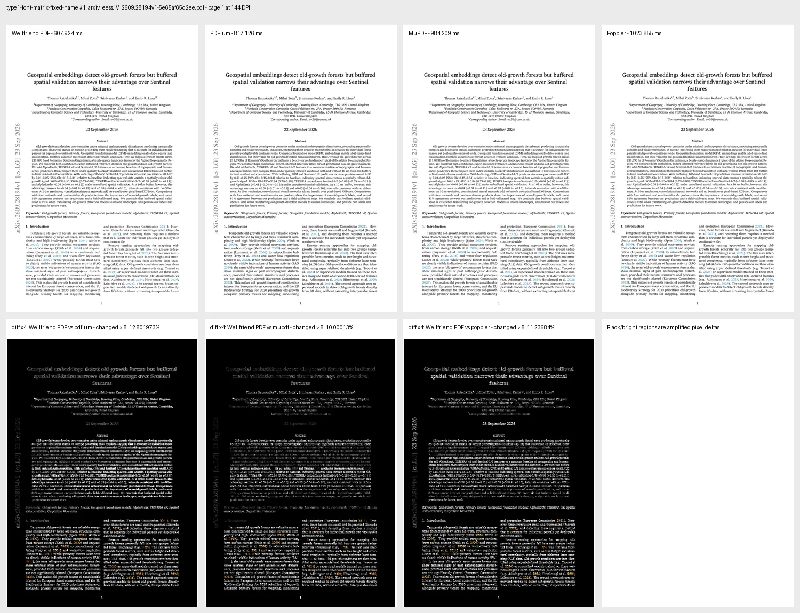

# Type 1 `/FontMatrix` renderer correction

The 2026-09-29 retained campaign exposed catastrophic overlapping text in
`arxiv_eess.IV_2609.28194v1-5e65af65d2ee.pdf`. The embedded Type 1 fonts use a
non-default `/FontMatrix` scale of `0.000488281` (approximately 1/2048), while
the renderer treated every Type 1 outline as a 1/1000-em outline. Glyphs were
therefore painted approximately 2.048 times too large even though PDF text
advances used the document's declared widths.

The source correction parses the embedded Type 1 `/FontMatrix`, rejects a
present malformed or singular matrix, and normalizes the full affine transform
(scale, shear, rotation, and translation) into the renderer's conventional
1000-unit glyph space. Raster and SVG consumers share the corrected outline.

## Exact VPS rerender

The exact original input SHA-256 was
`5e65af65d2ee115c583d84f68de8341b4cc38a4f839f5993e79005c28f69527b`.
It was rerendered on the project VPS at 144 DPI with the newly built release
CLI (SHA-256
`403f7cf028a55ee644e6a794114425d25ff45f95be85cb016dca600c219ad8a3`)
and the same PDFium, MuPDF, and Poppler reference paths. The retained run began
at `2026-09-28T21:47:52Z` and completed at `2026-09-28T21:48:01Z`.

| Reference | Before: changed > 8 | After: changed > 8 |
|---|---:|---:|
| MuPDF | 31.288504% | 10.000130% |
| Poppler | 31.454685% | 11.236840% |
| PDFium | 32.420260% | 12.801973% |

Manual inspection confirms that the unreadable, oversized, overlapping text is
gone. The remaining pixel differences include font-rasterization,
antialiasing, and other renderer fidelity differences; this focused rerender is
not a claim of pixel identity or a replacement for rerunning the entire corpus.

The raw single-file record is retained in [`results.jsonl`](results.jsonl).
The comparison artifact SHA-256 is
`4854a5040d669bd1cbfc5a006ba3cf106155f3c86b997261e0a1a5b3923a226f`.

The older full-corpus artifacts use `wellpdf` as a legacy harness key and panel
label. That shorthand was incorrect; this corrected record and the evidence
harness use **Wellfriend PDF SDK** and the `wellfriendpdf` binary name.
