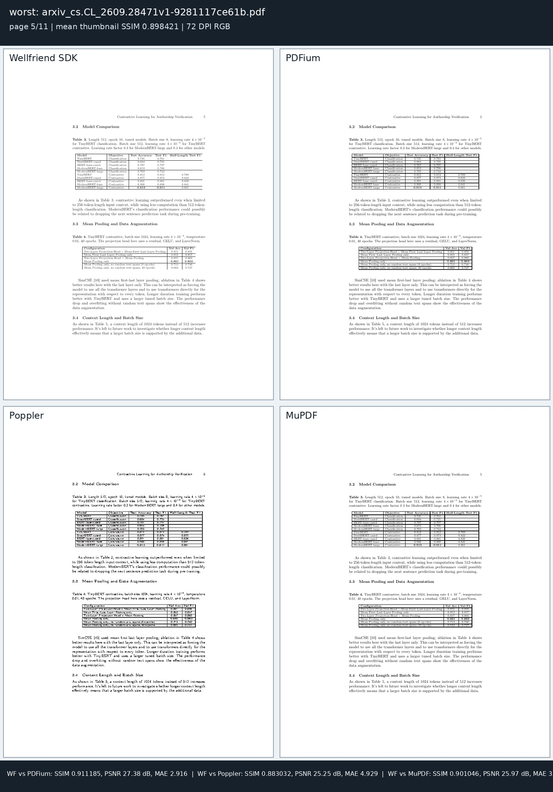
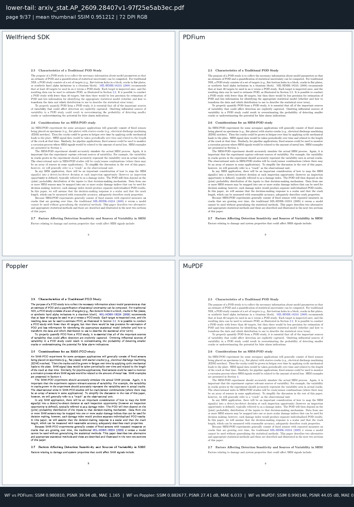
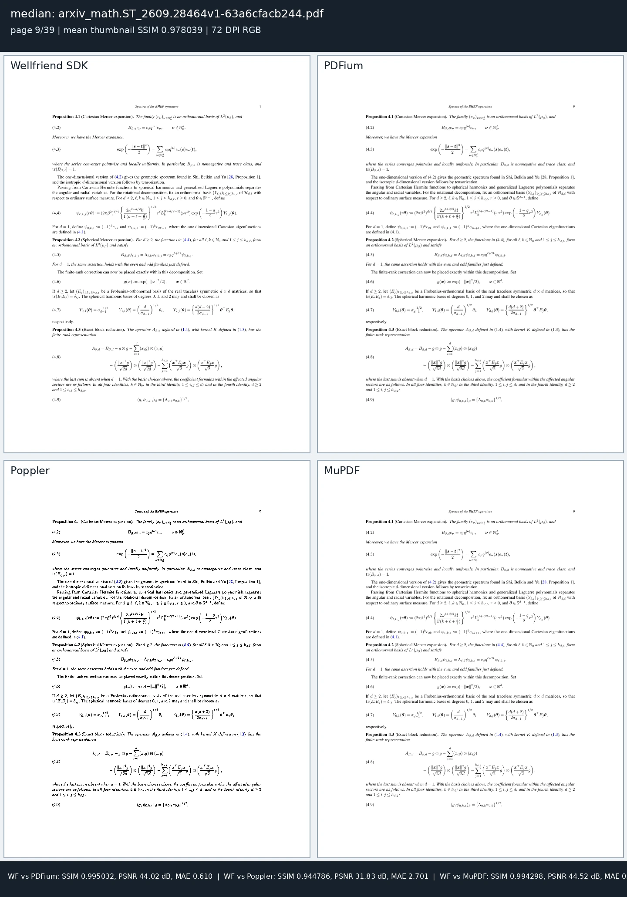
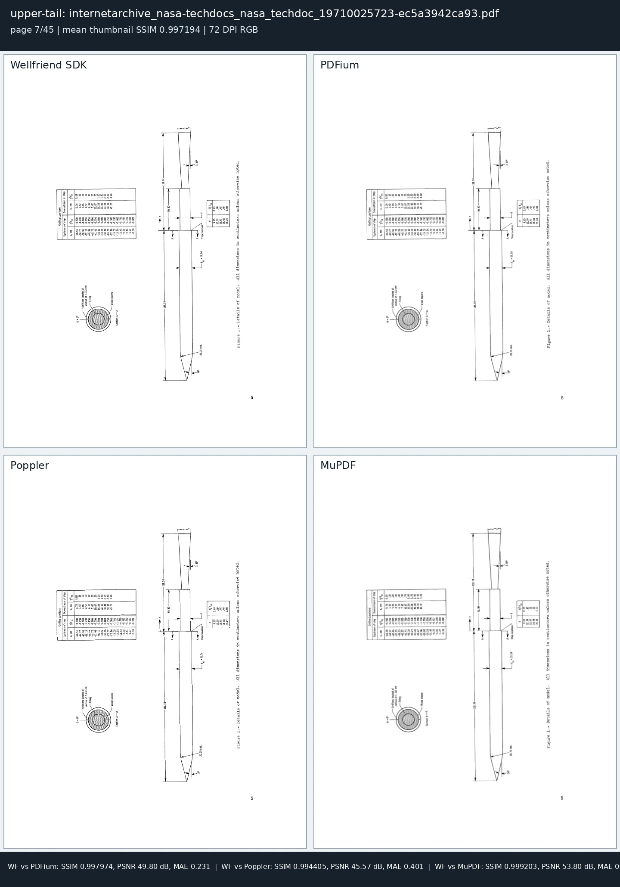

# Final 150-document benchmark

Renderer revision `1fd74f722222b12f5278e1b8dd886943770d6c0d` and parser/document-facility revision `fbd455829e7c726bf2457116e1723da058b26af3` are measured on 150 real PDFs (2.036 GiB, 9,214 pages) on one Linux VPS. Every tool receives the same corpus and operation contract. A facility passes only when its output reopens and its operation-specific structural, semantic, security, or visual postconditions hold; unsupported operations remain unsupported.

## Parsing and document facilities

Resident parsing opens the in-memory document and resolves page count after warm-up; fresh parsing includes process startup. Facility timings include quality-qualified passes only. Conversion token F1 is agreement with Poppler extraction, not semantic ground truth.

| Benchmark | Wellfriend SDK | PDFium | Poppler | MuPDF | qpdf |
| --- | --- | --- | --- | --- | --- |
| Parse correctness | 150/150 | 150/150 | 150/150 | 150/150 | 150/150 |
| Resident parse P50 | 1.15 ms | 0.72 ms | 3.18 ms | 3.02 ms | 5.04 ms |
| Resident parse P95 | 3.49 ms | 2.15 ms | 6.20 ms | 113.76 ms | 30.49 ms |
| Resident parse P99 | 11.58 ms | 6.15 ms | 13.40 ms | 454.79 ms | 59.19 ms |
| Resident parse maximum | 50.90 ms | 41.65 ms | 22.93 ms | 820.54 ms | 61.64 ms |
| Fresh-process parse P50 | 18.62 ms | 18.86 ms | 55.28 ms | 30.37 ms | 41.00 ms |
| Fresh-process parse P95 | 149.46 ms | 164.20 ms | 188.29 ms | 316.52 ms | 173.01 ms |
| Fresh-process parse maximum | 759.66 ms | 937.51 ms | 891.96 ms | 1,582.42 ms | 674.40 ms |
| merge | 150/150 qualified P50 213.76 ms; P95 3,654.58 ms; max 17,311.86 ms | N/A | 150/150 qualified P50 733.77 ms; P95 12,083.91 ms; max 58,064.18 ms | 143/150 qualified; 7 failed P50 142.84 ms; P95 1,460.92 ms; max 7,108.10 ms | 150/150 qualified P50 107.55 ms; P95 1,062.49 ms; max 3,866.50 ms |
| split | 150/150 qualified P50 84.32 ms; P95 716.31 ms; max 3,678.69 ms | N/A | 147/150 qualified; 3 failed P50 339.00 ms; P95 2,173.56 ms; max 12,078.04 ms | 141/150 qualified; 9 failed P50 53.06 ms; P95 108.38 ms; max 215.05 ms | 150/150 qualified P50 52.21 ms; P95 276.64 ms; max 1,105.69 ms |
| extract-pages | 150/150 qualified P50 77.37 ms; P95 804.59 ms; max 4,233.58 ms | N/A | 150/150 qualified P50 630.29 ms; P95 3,325.53 ms; max 13,161.39 ms | 141/150 qualified; 9 failed P50 29.73 ms; P95 55.13 ms; max 120.57 ms | 150/150 qualified P50 49.39 ms; P95 254.88 ms; max 1,417.04 ms |
| lock | 150/150 qualified P50 203.28 ms; P95 2,173.27 ms; max 9,356.47 ms | N/A | N/A | 150/150 qualified P50 125.60 ms; P95 1,456.04 ms; max 6,570.45 ms | 150/150 qualified P50 150.36 ms; P95 1,167.82 ms; max 5,531.15 ms |
| unlock | 150/150 qualified P50 175.11 ms; P95 1,795.93 ms; max 7,890.87 ms | N/A | N/A | 150/150 qualified P50 199.29 ms; P95 1,533.24 ms; max 7,571.06 ms | 150/150 qualified P50 141.90 ms; P95 1,466.27 ms; max 5,935.34 ms |
| rotate | 150/150 qualified P50 137.32 ms; P95 2,434.94 ms; max 24,874.89 ms | N/A | N/A | N/A | 150/150 qualified P50 86.16 ms; P95 726.35 ms; max 3,062.44 ms |
| repair | 150/150 qualified P50 116.56 ms; P95 757.80 ms; max 4,458.00 ms | N/A | N/A | 150/150 qualified P50 73.13 ms; P95 1,177.30 ms; max 2,375.86 ms | 150/150 qualified P50 435.01 ms; P95 10,296.60 ms; max 34,872.36 ms |
| organize | 150/150 qualified P50 80.93 ms; P95 924.32 ms; max 4,103.92 ms | N/A | 150/150 qualified P50 684.00 ms; P95 3,143.91 ms; max 15,258.38 ms | 141/150 qualified; 9 failed P50 30.86 ms; P95 63.91 ms; max 123.01 ms | 150/150 qualified P50 56.19 ms; P95 380.25 ms; max 1,631.32 ms |
| linearize | 150/150 qualified P50 189.91 ms; P95 2,371.69 ms; max 9,991.37 ms | N/A | N/A | N/A | 150/150 qualified P50 118.50 ms; P95 1,044.90 ms; max 5,157.87 ms |
| flatten | 150/150 qualified P50 115.84 ms; P95 1,116.39 ms; max 5,896.10 ms | N/A | N/A | N/A | 150/150 qualified P50 85.64 ms; P95 864.83 ms; max 2,948.51 ms |
| watermark | 150/150 qualified P50 154.66 ms; P95 1,737.82 ms; max 8,878.64 ms | N/A | N/A | N/A | N/A |
| page-numbers | 150/150 qualified P50 155.61 ms; P95 1,725.49 ms; max 8,423.41 ms | N/A | N/A | N/A | N/A |
| metadata | 150/150 qualified P50 107.39 ms; P95 2,577.70 ms; max 10,633.06 ms | N/A | N/A | N/A | N/A |
| crop | 150/150 qualified P50 124.03 ms; P95 1,523.96 ms; max 7,427.88 ms | N/A | N/A | N/A | N/A |
| resize | 150/150 qualified P50 397.77 ms; P95 1,658.04 ms; max 4,049.19 ms | N/A | N/A | N/A | N/A |
| nup | 150/150 qualified P50 694.93 ms; P95 2,338.78 ms; max 3,999.76 ms | N/A | N/A | N/A | N/A |
| optimize | 150/150 qualified P50 167.39 ms; P95 2,163.10 ms; max 8,446.07 ms | N/A | N/A | 149/150 qualified; 1 failed P50 103.00 ms; P95 5,885.34 ms; max 66,341.09 ms | 150/150 qualified P50 1,497.49 ms; P95 15,557.53 ms; max 47,407.92 ms |
| canonicalize | 150/150 qualified P50 214.85 ms; P95 3,661.61 ms; max 16,631.86 ms | N/A | N/A | 150/150 qualified P50 67.92 ms; P95 572.99 ms; max 2,236.47 ms | 150/150 qualified P50 363.59 ms; P95 3,735.10 ms; max 11,450.83 ms |
| sanitize | 150/150 qualified P50 201.60 ms; P95 3,226.29 ms; max 14,906.27 ms | N/A | N/A | N/A | N/A |
| sign | 150/150 qualified P50 219.17 ms; P95 3,542.30 ms; max 15,642.65 ms | N/A | 150/150 qualified P50 141.61 ms; P95 1,098.55 ms; max 5,268.58 ms | N/A | N/A |
| text | 150/150 qualified P50 262.26 ms; P95 2,298.74 ms; max 17,715.96 ms token F1 P50 0.950251 | N/A | 150/150 qualified P50 188.97 ms; P95 1,754.79 ms; max 29,320.31 ms token F1 P50 1.000000 | 149/150 qualified; 1 failed P50 166.31 ms; P95 1,167.06 ms; max 7,640.46 ms token F1 P50 0.972429 | N/A |
| html | 150/150 qualified P50 491.02 ms; P95 9,858.02 ms; max 89,235.22 ms token F1 P50 0.918116 | N/A | 150/150 qualified P50 198.76 ms; P95 1,898.32 ms; max 11,790.75 ms token F1 P50 0.886217 | 150/150 qualified P50 183.27 ms; P95 1,447.25 ms; max 11,156.80 ms token F1 P50 0.960763 | N/A |
| markdown | 150/150 qualified P50 521.60 ms; P95 9,689.52 ms; max 87,113.97 ms token F1 P50 0.921787 | N/A | N/A | N/A | N/A |
| json | 150/150 qualified P50 493.43 ms; P95 9,810.18 ms; max 91,872.99 ms token F1 P50 0.418431 | N/A | N/A | N/A | N/A |
| docx | 150/150 qualified P50 1,212.57 ms; P95 55,662.01 ms; max 625,898.94 ms token F1 P50 0.924338 | N/A | N/A | N/A | N/A |
| pptx | 150/150 qualified P50 1,233.87 ms; P95 53,456.90 ms; max 603,236.77 ms token F1 P50 0.924338 | N/A | N/A | N/A | N/A |
| xlsx | 150/150 qualified P50 487.86 ms; P95 9,571.48 ms; max 92,791.51 ms token F1 P50 0.924132 | N/A | N/A | N/A | N/A |
| svg-first-page | 150/150 qualified P50 2,393.40 ms; P95 13,130.54 ms; max 127,353.42 ms | N/A | N/A | 150/150 qualified P50 73.14 ms; P95 1,112.60 ms; max 1,808.32 ms | N/A |
| postscript-first-page | 150/150 qualified P50 2,228.03 ms; P95 12,650.90 ms; max 124,749.18 ms | N/A | 150/150 qualified P50 109.77 ms; P95 1,321.53 ms; max 1,773.57 ms | N/A | N/A |
| eps-first-page | 150/150 qualified P50 3,131.30 ms; P95 12,093.42 ms; max 122,045.52 ms | N/A | 150/150 qualified P50 113.77 ms; P95 903.26 ms; max 2,244.92 ms | N/A | N/A |
| png-first-page | 150/150 qualified P50 367.04 ms; P95 1,572.35 ms; max 4,219.85 ms | N/A | 150/150 qualified P50 330.87 ms; P95 737.59 ms; max 2,238.46 ms | 150/150 qualified P50 111.67 ms; P95 342.70 ms; max 478.89 ms | N/A |
| jpeg-first-page | 150/150 qualified P50 327.95 ms; P95 1,412.03 ms; max 5,165.54 ms | N/A | 150/150 qualified P50 143.50 ms; P95 327.36 ms; max 932.34 ms | N/A | N/A |
| tables-json | 150/150 qualified P50 447.71 ms; P95 5,820.16 ms; max 126,528.43 ms | N/A | N/A | N/A | N/A |
| pdfa-2b-validation | 150/150 qualified P50 179.04 ms; P95 1,699.35 ms; max 8,540.30 ms | N/A | N/A | N/A | N/A |
| pdfa-2b-conversion | 7/150 qualified; 143 refused P50 149.66 ms; P95 1,461.22 ms; max 1,461.22 ms veraPDF verified 7/7 qualified outputs; 8 refused artifacts rejected | N/A | N/A | N/A | N/A |

Wellfriend and veraPDF both execute PDF/A-2b validation reports across all 150 inputs; veraPDF classifies the source corpus as 0/150 compliant. Wellfriend converts 7/150 inputs to independently verified PDF/A-2b and refuses 143 files whose source fonts cannot be legally reconstructed as embedded fonts. Ghostscript emits 150 structurally readable files under the matched command, but veraPDF accepts 0/150 as PDF/A-2b.

## Visual rendering

Each renderer opens a document once and emits every page as 72-DPI RGB8. Timing includes only documents whose emitted page count matches the qpdf inventory. Thumbnail fidelity is measured on every matched page; first, middle, and last pages also receive full-resolution comparison. qpdf is a structural transformer, not a raster renderer.

| Benchmark | Wellfriend SDK | PDFium | Poppler | MuPDF | qpdf |
| --- | --- | --- | --- | --- | --- |
| Complete documents | 150/150 | 150/150 | 150/150 | 150/150 | N/A |
| Pages emitted / expected | 9,214/9,214 | 9,214/9,214 | 9,214/9,214 | 9,214/9,214 | N/A |
| All-page document P50 | 5,323.72 ms | 1,078.92 ms | 1,809.67 ms | 889.34 ms | N/A |
| All-page document P90 | 27,374.63 ms | 7,158.15 ms | 8,928.46 ms | 4,010.87 ms | N/A |
| All-page document P95 | 84,881.12 ms | 21,137.28 ms | 28,582.82 ms | 11,804.36 ms | N/A |
| All-page document P99 | 342,587.75 ms | 166,584.06 ms | 139,079.79 ms | 80,484.38 ms | N/A |
| All-page document maximum | 373,962.68 ms | 185,995.95 ms | 152,191.38 ms | 88,210.12 ms | N/A |
| Per-page P50 | 231.23 ms | 42.81 ms | 86.48 ms | 47.89 ms | N/A |
| Per-page P90 | 742.36 ms | 179.58 ms | 170.82 ms | 114.47 ms | N/A |
| Per-page P95 | 832.56 ms | 209.28 ms | 220.28 ms | 142.99 ms | N/A |
| Per-page P99 | 1,057.56 ms | 340.79 ms | 485.95 ms | 182.70 ms | N/A |
| Per-page maximum | 1,478.15 ms | 365.36 ms | 818.00 ms | 264.65 ms | N/A |
| Thumbnail SSIM vs Wellfriend (P50 / P05) | 1.000000 / 1.000000 | 0.999663 / 0.979476 | 0.985956 / 0.910557 | 0.998321 / 0.983639 | N/A |
| Thumbnail PSNR vs Wellfriend (P50) | Infinity | 54.440 | 37.169 | 47.721 | N/A |
| Full-resolution SSIM vs Wellfriend (P50) | 1.000000 | 0.939976 | 0.793696 | 0.964249 | N/A |

The comparison sheets below are inspected at source resolution before publication. They show the lowest-agreement page, a lower-tail page, the median page, and an upper-tail page selected from the measured distribution.

Exact distributions and tool-level outcomes are recorded in [summary.json](summary.json). The compressed per-file JSONL records are the authoritative evidence; [SHA256SUMS](evidence/SHA256SUMS) binds every published artifact.

Generated: `2026-10-09T01:31:45.582543+00:00`.
