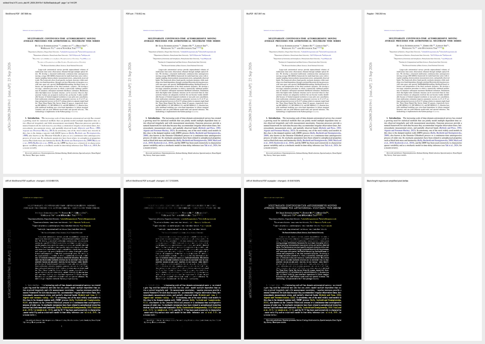
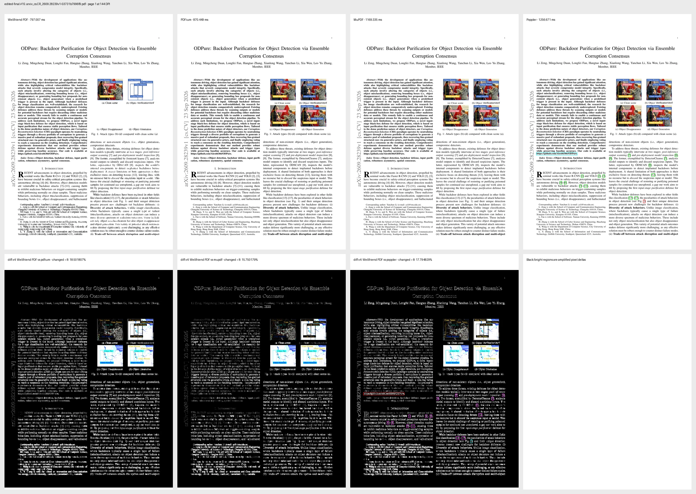
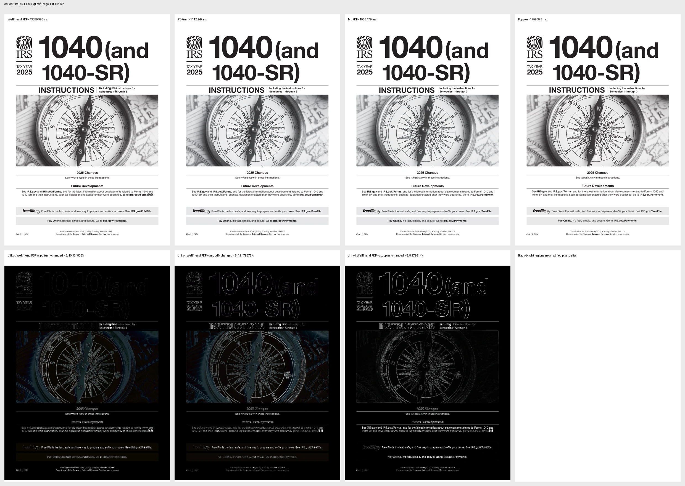

# RAPTOR 100-PDF VPS qualification — 2026-09-29

This report records the first stage-separated qualification of the
Revision-Aware PDF Transaction and Object Reuse (RAPTOR) implementation. It
does not claim universal PDF editing, pixel identity, or superiority over
Adobe. It records measured behavior of this exact campaign, including missed
latency objectives and typed non-applicable edits.

## Reproducibility identity

| Item | Value |
|---|---|
| VPS | `v72937`, 4 vCPU, 11 GiB RAM, no swap |
| Corpus | 100 real-world PDFs, 236 MiB |
| Corpus manifest SHA-256 | `c1356fbc00549cb30d20c794207a73b90aa5671b96c590843af8dd89f7743a0f` |
| Source base | `a9621b1d91b165a104dd871e4fc6770be2d8fbd2` |
| Tested source manifest SHA-256 | `b2f82fd6f540d462ab2f5fcb1442d2787b1e00d48a134d6d24d11832775080ea` |
| Rust engine tests | 4,318 passed, 0 failed; release profile; 244.11 s execution after link |
| Release integration build | CLI, C ABI, Python, and WASM built successfully |
| qpdf | 12.3.2 |
| MuPDF | 1.27.0 |
| Poppler | 26.01.0 |
| pypdfium2 | 5.13.0 |
| Core run | 100 retained release-build observations at 144 DPI |
| Final edit run | `2026-09-29T10:14:08Z` to `2026-09-29T10:20:26Z` |
| Final edited render run | `2026-09-29T10:20:58Z` to `2026-09-29T10:32:46Z` |

Percentiles use nearest rank. No timeout, failure, or non-applicable edit is
converted to a zero-duration success. Process benchmarks use one fresh process
per PDF and deterministic tool-order rotation where several tools are compared.

## Parsing

Tools are columns and measurements are rows. These commands do **different
work**: Wellfriend PDF performs structural open/page-tree work, qpdf performs
`qpdf --check`, MuPDF performs `mutool info`, and Poppler performs `pdfinfo`.
The table is useful operational evidence, not a semantic-equivalence claim.

| Parsing benchmark | Wellfriend PDF | qpdf | MuPDF | PDFium | Poppler |
|---|---:|---:|---:|---:|---:|
| Accepted | 100/100 | 100/100 (97 clean, 3 warnings) | 95/100 | Not run | 100/100 |
| P50 | 20.020 ms | 175.558 ms | 22.057 ms | — | 40.703 ms |
| P90 | 93.424 ms | 1,193.706 ms | 39.310 ms | — | 49.993 ms |
| P95 | 158.914 ms | 1,976.645 ms | 49.202 ms | — | 52.476 ms |
| P99 | 254.819 ms | 7,436.913 ms | 260.429 ms | — | 57.263 ms |
| Maximum | 315.642 ms | 11,081.225 ms | 260.429 ms | — | 59.346 ms |

The requested Wellfriend PDF structural-parse objective was P50 15 ms, P90
30 ms, P95 50 ms, P99 75 ms, and maximum 200 ms. Every gate failed. RAPTOR's
retained page-program stage is much faster after the document is open (warm
P50 0.233 ms, P99 1.388 ms), but that cache result must not be presented as
cold end-to-end parsing.

## Editing

The edit benchmark selects one unique first-page ASCII word, creates a
revision-bound source edit, applies it, reopens the output, and verifies that
the one source occurrence disappeared and the replacement appeared. Two files
were non-applicable: one had no unambiguous benchmark word and one planned as
`TargetNotFound`.

| Editing benchmark | Wellfriend PDF | qpdf | MuPDF | PDFium | Poppler |
|---|---:|---:|---:|---:|---:|
| Attempted | 100 | — | — | — | — |
| Applicable and verified | 98/98 | — | — | — | — |
| Typed non-applicable | 2/100 | — | — | — | — |
| Apply P50 | 2,115.375 ms | — | — | — | — |
| Apply P90 | 4,387.261 ms | — | — | — | — |
| Apply P95 | 5,208.620 ms | — | — | — | — |
| Apply P99 / maximum | 8,207.122 ms | — | — | — | — |
| Verified end-to-end P50 | 3,586.492 ms | — | — | — | — |
| Verified end-to-end P90 | 6,796.927 ms | — | — | — | — |
| Verified end-to-end P95 | 7,756.644 ms | — | — | — | — |
| Verified end-to-end P99 / maximum | 12,481.508 ms | — | — | — | — |

All 98 applicable outputs changed bytes, reopened, removed the selected source
occurrence from the reachable revision, and exposed the replacement exactly as
checked by the harness. This does not make incremental editing a sanitizing
redaction: historical bytes can remain in earlier revisions.

The requested 15/30/50/75/200 ms editing objectives failed at every percentile
for both apply and verified end-to-end latency.

## Visual rendering — process time

Page one was rendered at 144 DPI. Every row below is a fresh-process duration,
including tool startup and output production. Original and edited populations
are intentionally separate.

### Original PDFs (100 files)

| Render benchmark | Wellfriend PDF | qpdf | MuPDF | PDFium | Poppler |
|---|---:|---:|---:|---:|---:|
| Produced at matching dimensions | 100/100 | — | 100/100 | 100/100 | 100/100 |
| P50 | 429.657 ms | — | 937.965 ms | 709.383 ms | 848.875 ms |
| P90 | 707.937 ms | — | 1,058.059 ms | 787.518 ms | 1,097.819 ms |
| P95 | 877.839 ms | — | 1,072.552 ms | 833.069 ms | 1,146.968 ms |
| P99 | 1,391.595 ms | — | 1,236.113 ms | 1,023.804 ms | 1,375.845 ms |
| Maximum | 40,222.529 ms | — | 1,467.801 ms | 1,304.640 ms | 1,758.234 ms |

### Edited PDFs (98 applicable files)

| Render benchmark | Wellfriend PDF | qpdf | MuPDF | PDFium | Poppler |
|---|---:|---:|---:|---:|---:|
| Produced at matching dimensions | 98/98 | — | 98/98 | 98/98 | 98/98 |
| P50 | 432.789 ms | — | 944.190 ms | 705.232 ms | 871.752 ms |
| P90 | 716.201 ms | — | 1,156.429 ms | 851.732 ms | 1,139.882 ms |
| P95 | 1,005.492 ms | — | 1,185.603 ms | 867.605 ms | 1,209.075 ms |
| P99 / maximum | 43,689.996 ms | — | 1,526.179 ms | 1,112.247 ms | 1,759.373 ms |

Wellfriend PDF was at least 10% faster than the fastest reference at P50 and
P90. It failed that requirement at P95, P99, and maximum, so the overall
10%-faster claim is **failed**. `i1040gi.pdf` is the 43.690-second Wellfriend
outlier and remains a priority optimization target.

The retained in-process raster cache is effective but is a different workload:
warm raster P50/P90/P95/P99/max was 3.664/16.678/26.422/41.526/48.433 ms. Cold
raster P50/P90/P95/P99/max was
180.721/393.270/481.879/1,070.793/39,587.782 ms.

## Visual rendering — quality diagnostics

`Changed > 8` is the percentage of pixels for which at least one RGB channel
differs by more than 8. It is sensitive to antialiasing, color management, font
hinting, and raster policy. It is **not** the percentage of objectively wrong
pixels and has no universal pass threshold.

| Edited-output diagnostic | Wellfriend vs MuPDF | Wellfriend vs PDFium | Wellfriend vs Poppler |
|---|---:|---:|---:|
| P50 changed > 8 | 8.371346% | 9.955664% | 9.158321% |
| P90 changed > 8 | 11.375035% | 14.046511% | 12.903184% |
| P95 changed > 8 | 11.794105% | 14.402553% | 13.451663% |
| P99 / maximum changed > 8 | 15.750179% | 18.501807% | 17.794829% |

All 98 edited pages were recognizable in the retained four-renderer sheets.
Human inspection covered the previously misplaced replacement
`arxiv_stat.AP_2609.28419v1`, the maximum-divergence page
`arxiv_cs.CR_2609.28239v1`, and the slow `i1040gi.pdf` outlier. The replacement
now remains at its source position and all four renderers agree on placement.
This bounded inspection is not a claim that all 98 pages are pixel-perfect.

## What RAPTOR changed

RAPTOR adds immutable input identity reuse, revision-scoped transaction caches,
prepared source-analysis reuse, page-tree/object/page-artifact caching,
dependency-closure-aware renderer reuse, exact cache invalidation, and
append-only dependency-cone post-edit proof. The CLI and C, Python, and WASM
bindings expose retained sessions so callers can benefit from these paths
without changing correctness semantics.

The final source-position correction also separates explicit approved-region
layout from source-anchored inline editing. A local one-line edit without an
approved reflow region stays in the original text object; multiline relocation
without a region fails closed. Ambiguous whole-run CMap encodings route through
an embedded generated Type0 font rather than producing a misplaced overlay or
rejecting after mutation routing.

RAPTOR is a project-originated architecture composed from established ideas;
no formal novelty or patent search has been completed. See the
[research note](../../research/revision_aware_pdf_transaction_and_object_reuse.md).

## Raw evidence

- [`summary.json`](summary.json): derived nearest-rank statistics and SLO checks.
- [`core-results.jsonl`](core-results.jsonl): 100-file stage-separated parser,
  semantic, page-program, and renderer measurements.
- [`editing-results.jsonl`](editing-results.jsonl): 100 attempted edit records.
- [`external-parsers.jsonl`](external-parsers.jsonl): qpdf, MuPDF, and Poppler
  fresh-process observations.
- [`source-manifest.sha256`](source-manifest.sha256): hashes of every modified
  or added crate/harness source file used by the VPS build.
- [`edited-visual-results.jsonl`](edited-visual-results.jsonl): per-file commands,
  raster hashes, dimensions, timings, and difference metrics.
- [`visual/edited/contacts`](visual/edited/contacts): four readable contact sheets.

The exact corpus PDFs are not republished here. The manifest hash, per-input
SHA-256 values, command lines, versions, timestamps, and output hashes are
retained so an authorized copy of the corpus can reproduce the run.
