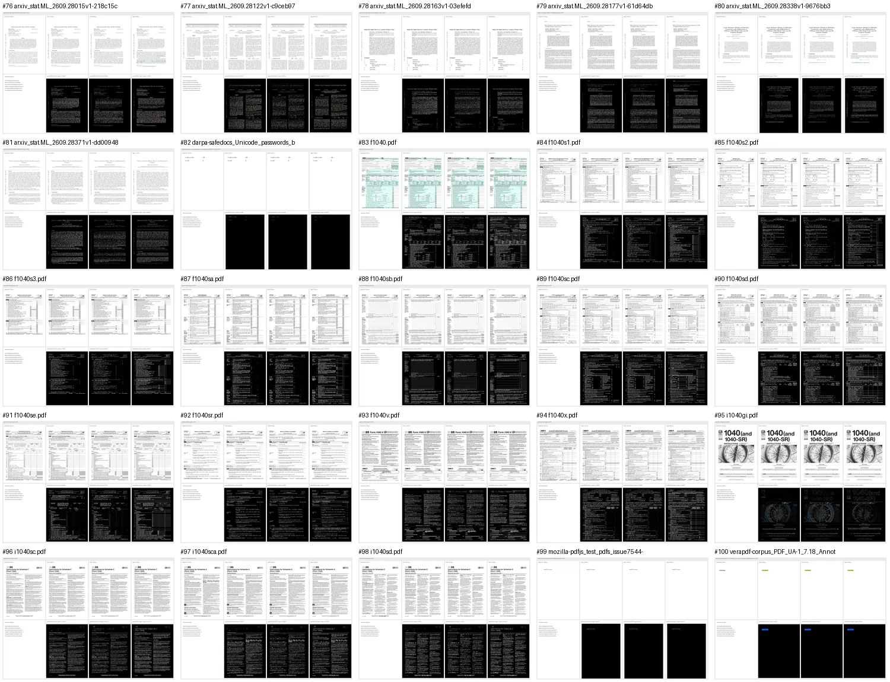
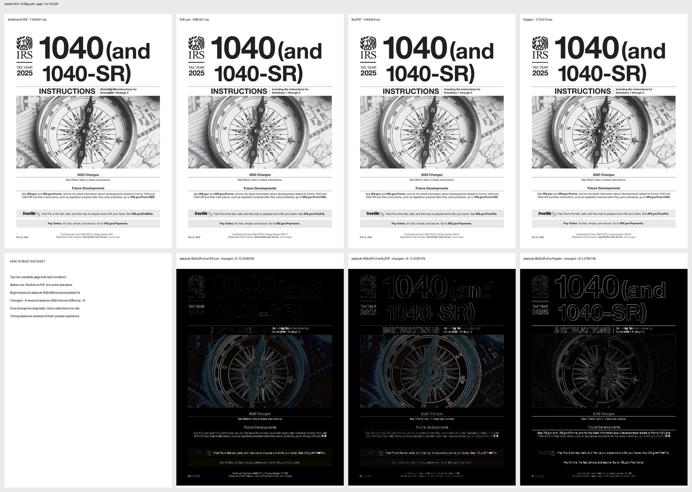

# raptor-vps-20260930-final

Generated `2026-09-30T02:00:00Z` from source `74735651a60b871b84d4936119dfa4db7b87152afe2e0825bf5302995dbc1e06` and corpus manifest
`04f8727b0445e019168877249ebfd95bf5f39ec89317168e06d0a8d92668ecc1`. Percentiles use nearest rank. Repeated process
measurements are collapsed to a per-document median before corpus percentiles.
Failures and timeouts remain in the reported denominator.

## Validation gate

All Rust work ran on the four-core VPS. The canonical serial release command,
`cargo test --release --workspace --no-fail-fast` with `CARGO_BUILD_JOBS=1`,
completed with 5,412 passed and zero failed tests across 79 test-result groups.
The engine library contributed 4,320/4,320 passes in 200.52 seconds. The serial
job bound was required because an earlier parallel workspace link exceeded the
11 GiB host memory limit; that infrastructure failure is not counted as a test
pass. The final logs are retained beside this report.

The external OCR smoke suite is included in the workspace result. Its live
Tesseract cases are serialized at the test boundary to prevent independent
full-page jobs from consuming one another's deadlines; the multi-page test
still exercises the production backend's bounded internal concurrency.

## Parsing

| Benchmark | Wellfriend PDF | qpdf | MuPDF | PDFium | Poppler |
|---|---:|---:|---:|---:|---:|
| Accepted | 100/100 | 100/100 | 95/100 | not measured | 100/100 |
| Workload | xref open + indexed page count | structural check | document inventory | not measured | metadata + page count |
| P50 | 1.959 ms | 159.358 ms | 21.008 ms | — | 38.457 ms |
| P90 | 3.474 ms | 1,121.336 ms | 39.362 ms | — | 46.655 ms |
| P95 | 3.826 ms | 1,801.061 ms | 44.569 ms | — | 51.971 ms |
| P99 | 20.176 ms | 7,271.322 ms | 265.436 ms | — | 60.162 ms |
| Maximum | 44.338 ms | 9,283.166 ms | 265.436 ms | — | 63.557 ms |

The workload row is part of the result: unlike operations are not equivalent
speed claims. Requested-page materialization, full page-tree traversal, page
program parsing, and semantic extraction are reported separately in `summary.json`.

## Editing

| Benchmark | Wellfriend PDF | qpdf | MuPDF | PDFium | Poppler |
|---|---:|---:|---:|---:|---:|
| Applicable and verified after reopen | 98/98 | — | — | — | — |
| Typed non-applicable | 2/100 | — | — | — | — |
| Plan P50 / P95 / max | 1,208.958 ms / 2,465.182 ms / 4,456.134 ms | — | — | — | — |
| Apply P50 / P95 / max | 1,306.047 ms / 3,161.706 ms / 5,182.854 ms | — | — | — | — |
| Independent reopen verification P50 / P95 / max | 27.509 ms / 111.824 ms / 184.285 ms | — | — | — | — |
| Verified end to end P50 / P95 / max | 2,624.005 ms / 6,196.141 ms / 9,193.955 ms | — | — | — | — |

Apply includes authenticated transaction reuse, native mutation, serialization,
internal reopen, and postconditions. The final row also includes the harness's
independent reopen and extraction check.

## Visual rendering time

### Original inputs

| Benchmark | Wellfriend PDF | qpdf | MuPDF | PDFium | Poppler |
|---|---:|---:|---:|---:|---:|
| Rendered outputs | 100/100 | — | 100/100 | 100/100 | 100/100 |
| P50 | 406.167 ms | — | 946.182 ms | 694.410 ms | 841.898 ms |
| P90 | 632.020 ms | — | 1,047.133 ms | 774.717 ms | 1,073.674 ms |
| P95 | 732.437 ms | — | 1,070.129 ms | 803.991 ms | 1,104.522 ms |
| P99 | 1,264.523 ms | — | 1,208.693 ms | 1,014.655 ms | 1,292.722 ms |
| Maximum | 1,310.240 ms | — | 1,671.627 ms | 1,102.913 ms | 1,716.905 ms |

### Verified edited outputs

| Benchmark | Wellfriend PDF | qpdf | MuPDF | PDFium | Poppler |
|---|---:|---:|---:|---:|---:|
| Rendered outputs | 98/98 | — | 98/98 | 98/98 | 98/98 |
| P50 | 407.149 ms | — | 906.762 ms | 682.421 ms | 848.388 ms |
| P90 | 663.924 ms | — | 1,030.038 ms | 772.669 ms | 1,081.573 ms |
| P95 | 875.002 ms | — | 1,113.652 ms | 821.685 ms | 1,135.360 ms |
| P99 | 1,317.898 ms | — | 1,444.954 ms | 1,086.931 ms | 1,710.013 ms |
| Maximum | 1,317.898 ms | — | 1,444.954 ms | 1,086.931 ms | 1,710.013 ms |

These are fresh-process page-one measurements at the campaign DPI. Internal
cold raster, retained raster, and image encoding remain separate in
`summary.json`. Quality is not inferred from speed: pairwise raster metrics,
reference disagreement, hashes, full-page panels, and amplified difference
panels are separate evidence.

## Visual divergence diagnostics

### Original inputs

| Pair | P50 changed > 8 | P95 | P99 | Maximum |
|---|---:|---:|---:|---:|
| Wellfriend vs MuPDF | 8.370160% | 11.678849% | 12.477615% | 15.770450% |
| Wellfriend vs PDFium | 9.961286% | 14.403017% | 14.949227% | 18.511040% |
| Wellfriend vs Poppler | 9.151513% | 13.215127% | 13.609234% | 17.801277% |
| PDFium vs MuPDF | 8.692221% | 12.326389% | 12.992878% | 13.016707% |
| PDFium vs Poppler | 10.050051% | 14.506627% | 15.291497% | 15.554235% |
| MuPDF vs Poppler | 7.339937% | 10.629683% | 11.106108% | 13.007887% |

### Verified edited outputs

| Pair | P50 changed > 8 | P95 | P99 | Maximum |
|---|---:|---:|---:|---:|
| Wellfriend vs MuPDF | 8.371346% | 11.794105% | 15.750179% | 15.750179% |
| Wellfriend vs PDFium | 9.955664% | 14.402553% | 18.501807% | 18.501807% |
| Wellfriend vs Poppler | 9.158321% | 13.451663% | 17.794829% | 17.794829% |
| PDFium vs MuPDF | 8.686985% | 12.320870% | 13.012839% | 13.012839% |
| PDFium vs Poppler | 10.056550% | 14.506310% | 15.545157% | 15.545157% |
| MuPDF vs Poppler | 7.337095% | 10.753986% | 13.007320% | 13.007320% |

`Changed > 8` is the fraction of pixels where at least one RGB channel differs
by more than eight levels. It exposes disagreement but is not an objective error
rate: antialiasing, hinting, and colour policy also contribute. Reference-to-reference
rows make that baseline disagreement visible.

## Visual evidence

The contact sheet keeps the corpus overview compact; each `pages/` directory
contains the corresponding full four-renderer sheet and amplified differences.

## Status

- Core documents: 100; raw repetitions: 300; failures: 0.
- Applicable verified edits: 98; edit failures/refusals: 2.
- Original visual passes: 100; failures: 0.
- Edited visual passes: 98; failures: 0.
- Requested edit-apply latency gate: fail.
- Requested verified-edit latency gate: fail.
- Ten-percent original-render lead gate: fail.
- Ten-percent edited-render lead gate: fail.
