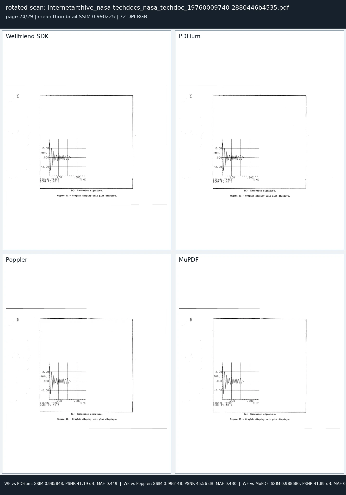
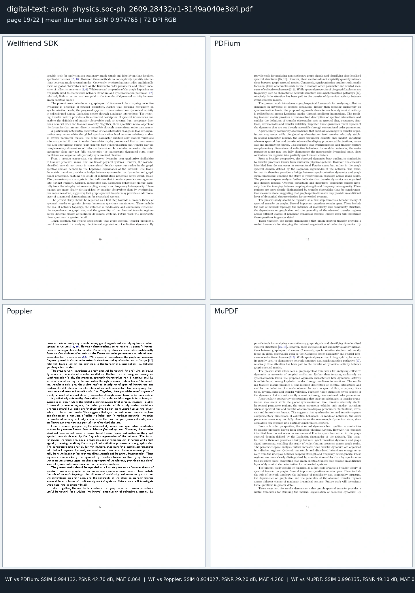
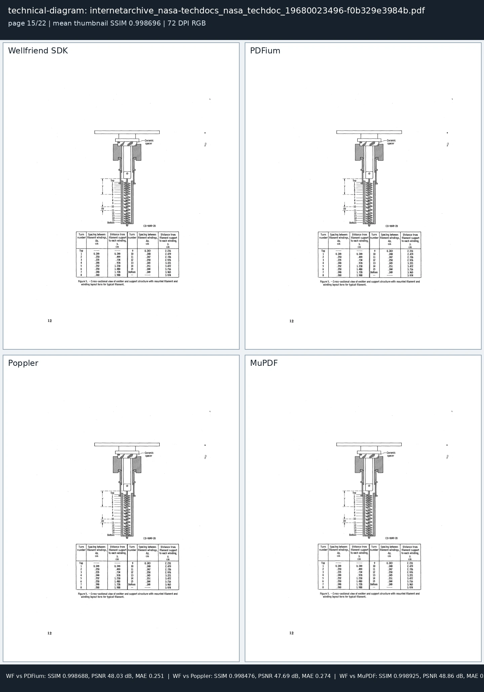

# Renderer qualification - 2026-10-05

This report records the optimized Wellfriend renderer qualification on a
150-document public and interoperability corpus. Every result is tied to the
source revision, binary hash, corpus manifest, command line, and raw evidence.

## Result

| Verification | Result |
|---|---:|
| Image-painter unit regressions | 29/29 pass |
| Tiling-pattern unit regressions | 16/16 pass |
| Focused real-PDF compatibility pages | 15/15 pass |
| Directly inspected Wellfriend/PDFium/Poppler/MuPDF sheets | 4/4 readable and clean |
| All-page corpus documents | 150/150 |
| Corpus pages rendered | 9,214/9,214 |
| Render errors | 0 |
| Display-list fallbacks | 0 |

## Performance

These timings measure the complete 150-document, all-page command with one
document worker. Per-document values include opening, compiling, and rendering
every page in that document; the corpus contains documents from one to 1,518
pages.

| Measurement | Result |
|---|---:|
| Complete corpus wall time | 3,244.289 s (54m 04.289s) |
| Per-document end-to-end median | 7,550.993 ms |
| Per-document end-to-end p95 | 100,343.289 ms |
| Per-document end-to-end p99 | 393,705.734 ms |
| Per-document end-to-end maximum | 435,915.426 ms |
| Per-page first-render median | 224.840 ms |
| Per-page first-render p95 | 796.641 ms |
| Peak resident memory | 2,938,232 KiB |

## Visual comparison

All four sheets are generated from the release binary recorded below and the
native PDFium, Poppler, and MuPDF adapters. Metrics use normalized 96-pixel
thumbnails; each sheet is also inspected at original resolution.

| Page | Mean SSIM against three references | Inspection |
|---|---:|---|
| Scan minification | 0.993142 | Readable, continuous grayscale; no halftone-dot aliasing |
| Rotated scan | 0.990225 | Matching 754 x 561 geometry and orientation |
| Digital text | 0.974765 | Matching text geometry; renderer-specific antialiasing remains visible |
| Technical diagram | 0.998696 | Matching diagram, table, labels, and page geometry |








## Scan minification

Four-sample bilinear shrinking aliases high-frequency scanned halftones into
large black-and-white moire dots.

The renderer now integrates the complete source footprint of each destination
pixel when an opaque 8-bit grayscale or RGB image shrinks on both axes. The
same area-sampling rule applies to general minification paths. Magnification
retains the PDF default nearest-neighbor behavior when `/Interpolate` is absent.

Direct pixel inspection compares a scanned cover, a rotated scan, digital text,
and a technical diagram with PDFium, Poppler, and MuPDF. Text, diagrams,
grayscale detail, and page geometry are readable and clean.

## Page and image orientation

Image fast-path eligibility is evaluated after the page, image, and device
transforms are composed. Canonical top-down axis-aligned draws use the cached
scaled raster. Rotation, reflection, and affine placement use inverse mapping
with explicit PDF-image-space to decoded-row conversion.

The asymmetric 2 x 2 rotation regression verifies pixel orientation. A real
`/Rotate 90` scanned page produces the same 754 x 561 output dimensions in all
four renderers and a mean reference SSIM of 0.990225.

## Source changes

| Area | Implemented behavior |
|---|---|
| Image minification | Source-footprint box reduction prevents halftone aliasing |
| Large image masks | Matching JPEG and grayscale soft masks share bounded reduction |
| Indexed palettes | Complete palette prefixes are required; bounded producer padding is ignored |
| Raw image streams | A producer line ending after an otherwise complete unfiltered raster is ignored |
| Form geometry | Indirect `/BBox` and `/Matrix` arrays resolve through the object graph |
| Page content | Indirect `/Contents` arrays resolve recursively with cycle and size guards |
| Marked content | Render-only compatibility parsing recovers valid `BDC`/`DP` suffixes |
| Optional content | Unlisted groups inherit the active configuration's `/BaseState` |
| Transfer functions | Screen preview treats `/TR2 /Default` as the default identity transfer |
| Nested graphics state | Form and soft-mask retained programs receive invoking color state and resources |
| Pattern inheritance | Retained Forms and soft masks preserve inherited pattern resources and `SCN` names |
| Tiling patterns | Surface-relative work budgets, proven BBox containment, and tile-local clip reclamation bound repeated-cell work and memory |
| Image orientation | Fully composed transforms select the fast path; affine sampling preserves decoded row order across rotation and reflection |

## Reproducibility

- Source commit: `0539f33972b677512aaf336573a6a8385d0cf3bd`
- Release binary SHA-256: `d02e9a9346120328537da72ea697f2c37969eab1ff52c86d76edb45353691959`
- VPS source verification: the renderer sources match the source commit byte-for-byte
- Corpus: 150 PDFs, 9,214 pages, 2.036 GiB
- Corpus manifest SHA-256: `c5c357d38acd2a46e271ce42998abfc414811d9741ffd72c964ce2ced59e931d`
- Host: `v72937`, Linux x86-64, 4 logical CPUs
- Pipeline: display list, document cache on, one worker
- Output: 72 DPI RGB, compatibility compositing, raw-pixel hashes
- Per-page timeout: 120,000 ms

```bash
target/release/wellfriendpdf render-corpus \
  /root/raptor-corpus-150-20261003 \
  --pages all \
  --dpi 72 \
  --pipeline display-list \
  --document-cache on \
  --evidence raw \
  --workers 1 \
  --timeout-ms 120000 \
  --jsonl /root/wf-render-closure-20261004/wellfriend-all-pages-final.jsonl \
  --summary /root/wf-render-closure-20261004/wellfriend-all-pages-final-summary.json
```

Raw evidence:

- `environment.json`: host, comparator versions, binary hashes, and render contract.
- `corpus-manifest.json`: one SHA-256 and byte count per input PDF.
- `wellfriend-all-pages-final.jsonl`: one record per PDF.
- `wellfriend-all-pages-final-summary.json`: aggregate page counts, timings, memory,
  cache, raster, and compositor counters.
- `focused-final/*.json`: the 15 focused compatibility pages.
- `renderer-regressions.log`: the exact 29 image-painter and 16 tiling-pattern
  unit-test results.
- `visual-final/`: four-renderer comparison sheets and their metric records.

| Evidence file | SHA-256 |
|---|---|
| `wellfriend-all-pages-final.jsonl` | `17cb2df47d309ea57c9a5977c0409a299db68218c20ba13c49b7dd4449edce1b` |
| `wellfriend-all-pages-final-summary.json` | `967f1eaf0fe46a3be1a1e2d8428b4145148fe577c4820191bc17b81e0100be70` |
| `renderer-regressions.log` | `cb7f675236646aeede919b1adcb210ac25ec72115e8f838b1801f949494dabda` |

## Focused closure set

The 15-page set targets retained Forms, image XObjects, indirect page content,
optional content, transfer functions, nested graphics resources, and large
image/mask cases selected during renderer closure.

Each focused record reports `fully_supported: true`,
`unsupported_ops: 0`, and `display_list_rendered`.
